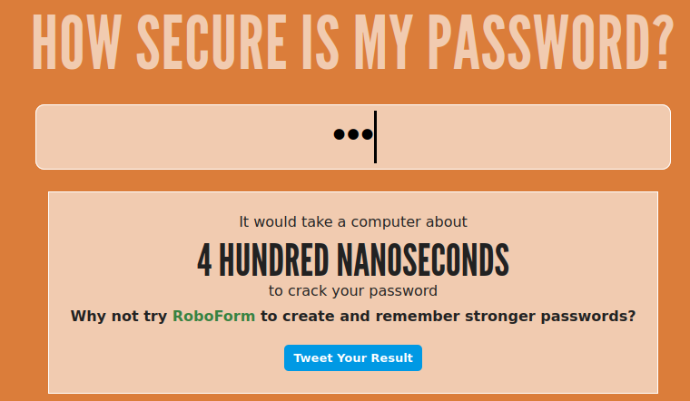
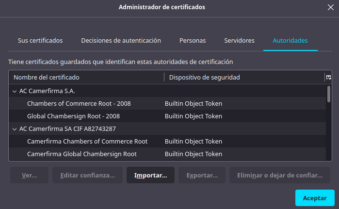
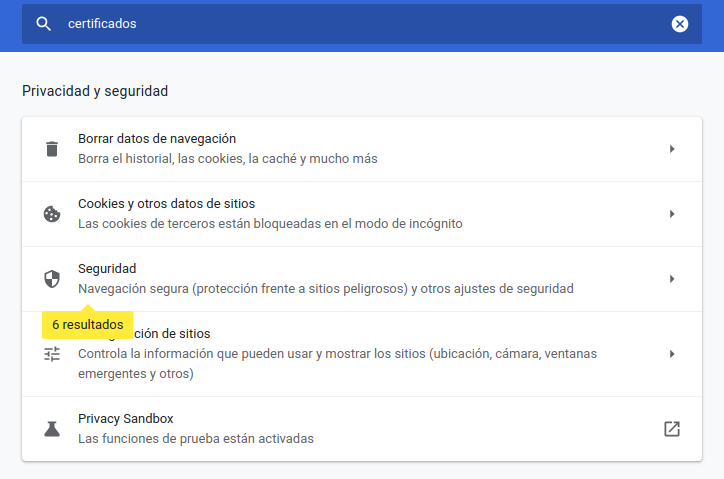
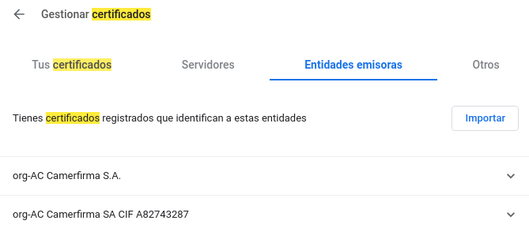

1. Busca en Internet alguna aplicación que muestre la fortaleza de una contraseña. Utilizando esa aplicación determina la fortaleza de una contraseña con las siguientes características:

1. Tres caracteres en minúsculas.
2. Siete caracteres mezclando mayúsculas, minúsculas y caracteres especiales.

###### Página a utilizar:

*`https://howsecureismypassword.net/`*

###### Contraseña a utilizar

*`BullSH1T++`*

###### Resultado

2. Describe detalladamente donde se pueden ver los certificados digitales que hay instalados en un navegador.

### ***Firefox***

Para acceder a los certificados digitales de Firefox se debe de abrir la pestaña de configuración del mismo, luego nos dirigiremos a la pestaña de Privacidad y Seguridad, en esta pagina vemos un apartado de certificados con la opción de ver certificados, abriremos esa opción y tendremos los permisos en forma de tabla.

### ***Chromium***

Para acceder a los certificados digitales debemos de acceder a la configuración de el navegador, y en la barra de búsqueda escribimos *Certificados* y nos resaltará un apartado con 6 coincidencias en **Seguridad**

Bajamos al final de la pagina y nos encontraremos con el apartado de **Certificados**

Dentro de este apartado podemos ver las siguientes opciones.

3. Escribe tres acciones que mejorarían la seguridad de un sistema.

* Cortafuegos bien configurado
* Inspeccionar las fuentes de las que provienen las descargas y mensajes que le llegan al usuario
* Mirar que los sitios sean seguros (**protocolo https**).

4. Pon un ejemplo de cada una de las siguientes amenazas:
  1.  Interrupción.

    Ataque para tumbar un servicio, por ejemplo muchas solicitudes de ping seguidas de paquetes muy grandes.

  2.  Interceptación.

    El uso de una "piña" para captar las ip y las mac de dispositivos móviles.

  3.  Modificación.

    Un virus que se ejecuta en el ordenador de la persona y modifica el equipo para que no muestre que se está ejecutando como proceso.

  4.  Fabricación.

    Añadir registros a un archivo.

5. Investiga en Internet y enumera tres sistemas de control de acceso para personas.

    * Sistemas biométricos.

    * Pin numérico.

    * Tarjetas de proximidad.

6. Describe brevemente las partes más importantes de las que consta un grupo electrógeno.

* **Motor**: Genera fuerza mecánica para que el rotor del generador eléctrico funcione.

* **Regulador de velocidad**: La fuerza mecánica del motor de combustión se adecúa con un alternador. El objetivo es poder garantizar que la velocidad del motor sea la adecuada.

* **Motor de arranque**: Sistema encargado de iniciar la máquina de combustión.

* **Sistema de refrigeración**: Compuesto de un radiador y de un ventilador, su objetivo es reducir la temperatura del motor del equipo electrógeno.

* **Filtro de aire**: Se asegura de que el aire no tenga impurezas.

* **Aislador de vibraciones**: Debido a que son máquinas muy grandes es necesario reducir las vibraciones al mínimo, además de que también se encarga de recudir el ruido generado por la misma.

* **Panel de control**: Controla el funcionamiento del grupo electrónico.

7. Investiga en qué consiste la tecnología de los “nanotubos” y su aplicación a la construcción de discos duros.

La construcción de memorias basada en nanotubos de carbono presenta una serie de ventajas asombrosas, con respecto a las memorias actuales:

  * Mayor velocidad de lectura y escritura

  * Alta fiabilidad: es capaz de almacenar datos durante 1000 años a temperaturas de 85 grados Celsius, y durante 10 años a 300 grados Celsius.

  * Bajo consumo: en modo reposo tiene un consumo de energía cercano a cero.

  * Escalable: en el futuro podrá fabricarse con tecnología inferior a los 5 nm (nanómetros).

  * Actualmente los chips más avanzados utilizan tecnología de entre 14 y 20 nm.

  * Elevada duración: en las pruebas ha resistido más ciclos de escritura que las actuales memorias Flash.

  * Bajo coste: resulta barata y fácil de fabricar.

8. ¿Cuántas claves serían necesarias para que 3 personas se intercambiaran información utilizando cifrado simétrico? ¿Y si fuesen 4 personas?

* Cuando 2 personas se comunican entre sí, se crea 1 clave de cifrado simétrico.

* Para que 3 personas intercambien información entre ellas se necesitan 3 claves, una por persona y por par de combinaciones posible.

* Cuando añades una cuarta persona. se forman 3 combinaciones de comunicaciones más, por lo que se necesitan 3 claves más, haciendo un total de 6  

9. Describe detalladamente cómo conseguir un certificado digital para una persona jurídica.

10. Descarga la herramienta The Forensic ToolKit, instálala en tu equipo y ejecútala. Describe la salida de un comando.
