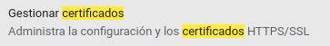

1. Busca en Internet alguna aplicación que muestre la fortaleza de una contraseña. Utilizando esa aplicación determina la fortaleza de una contraseña con las siguientes características:

1. Tres caracteres en minúsculas.
2. Siete caracteres mezclando mayúsculas, minúsculas y caracteres especiales.

###### Página a utilizar:

*`https://howsecureismypassword.net/`*

###### Contraseña a utilizar

*`BullSH1T++`*

###### Resultado

2. Describe detalladamente donde se pueden ver los certificados digitales que hay instalados en un navegador.

### ***Firefox***

Para acceder a los certificados digitales de Firefox se debe de abrir la pestaña de configuración del mismo, luego nos dirigiremos a la pestaña de Privacidad y Seguridad, en esta pagina vemos un apartado de certificados con la opción de ver certificados, abriremos esa opción y tendremos los permisos en forma de tabla.

### ***Chromium***

Para acceder a los certificados digitales debemos de acceder a la configuración de el navegador, y en la barra de búsqueda escribimos *Certificados* y nos resaltará un apartado con 6 coincidencias en **Seguridad**

Bajamos al final de la pagina y nos encontraremos con el apartado de **Certificados**

Dentro de este apartado podemos las siguientes opciones.

3. Escribe tres acciones que mejorarían la seguridad de un sistema.

* Cortafuegos bien configurado
* Inspeccionar las fuentes de las que provienen las descargas y mensajes que le llegan al usuario
* Acceder a sitios seguros (**protocolo https**)

4. Pon un ejemplo de cada una de las siguientes amenazas:
  1.  Interrupción.

    Un recurso del sistema es destruido o se vuelve no disponible. Este es un ataque contra la disponibilidad. Ejemplos de este ataque son la destrucción de un elemento hardware, como un disco duro, cortar una línea de comunicación o deshabilitar el sistema de gestión de ficheros

  2.  Interceptación.

    Una entidad no autorizada consigue acceso a un recurso. Este es un ataque contra la confidencialidad. La entidad no autorizada podría ser una persona, un programa o un ordenador. Ejemplos de este ataque son pinchar una línea para hacerse con datos que circulen por la red y la copia ilícita de ficheros o programas (intercepción de datos), o bien la lectura de las cabeceras de paquetes para desvelar la identidad de uno o más de los usuarios implicados en la comunicación observada ilegalmente (intercepción de identidad)

  3.  Modificación.

    La modificación se da cuando un virus se introduce al sistema y modifica archivos, de manera que queden inservibles, ya sea encriptándolos o directamente borrandolos

  4.  Fabricación.

    Cuando un pc es infectado y el virus empieza a reproducirse para recrearse a sí mismo

5. Investiga en Internet y enumera tres sistemas de control de acceso para personas.

    * Sistemas biométricos.

    * Pin numérico.

    * Tarjetas de proximidad.

6. Describe brevemente las partes más importantes de las que consta un grupo electrógeno.

7. Investiga en qué consiste la tecnología de los “nanotubos” y su aplicación a la construcción de discos duros.

8. ¿Cuántas claves serían necesarias para que 3 personas se intercambiaran información utilizando cifrado simétrico? ¿Y si fuesen 4 personas?

* Cuando 2 personas se comunican entre sí, se crea 1 clave de cifrado simétrico.

* Para que 3 personas intercambien información entre ellas se necesitan 3 claves, una por persona y por par de combinaciones posible.

* Cuando añades una cuarta persona. se forman 3 combinaciones de comunicaciones más, por lo que se necesitan 3 claves más, haciendo un total de 6  

9. Describe detalladamente cómo conseguir un certificado digital para una persona jurídica.

10. Descarga la herramienta The Forensic ToolKit, instálala en tu equipo y ejecútala. Describe la salida de un comando.
