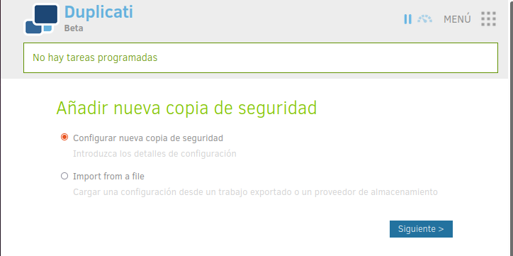
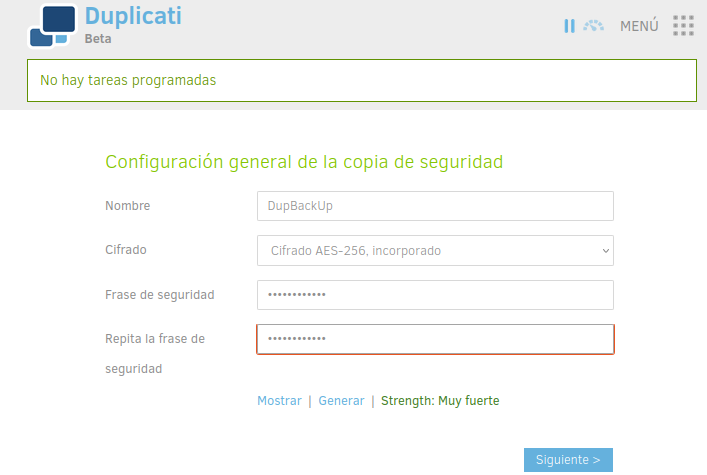

# Duplicati

### Proceso de instalación

Descargamos Duplicati y ejecutamos el comando ```dpkg -i``` para poder instalar este paquete.

Pero nos da un error, para solucionarlo deberemos de arreglar las licencias que hayan sido incumplidas.


Para esto utilizamos los siguientes comandos.


### Configuracion de Duplicati

Al abrir Duplicati nos encontramos con la siguiente pantalla, en la que deberemos de acceder arriba a la izquierda al apartado de añadir copia de seguridad.


Configuramos nuestra nueva copia de seguridad.



Especificamos el nombre de nuestra copia de seguridad, e cifrado que queremos para esta y una frase o contraseña de seguridad.



Ahora debemos de elegir nuestro servicio deslocalizado para hacer la copia de seguridad de nuestros archivos.


Nos pedirá la creación de una nueva carpeta, la creamos.

 

Ahora debemos de elegir los archivos que queremos asegurar.


Elegimos un horario en el que se realizaran nuestras copias de seguridad.


Elegimos el tiempo de vida de nuestras BackUps.


### Backup

Ahora es turno de ejecutar Duplicati y comprobar que nuestra backup está en Google Drive.


### Restaurar Backup

Vemos que ha sido todo un exito, ahora debemos comprobar que nuestra backup funciona, para ello eliminamos nuestros archivos y los restauramos de nuevo


Nos vamos a Duplicati a la seccion de Restaurar


Elegimos los 2 ficheros a restaurar.


Especificamos la ubicacion que queremos para ellos.


Vemos que han sido restaurados con éxito.


