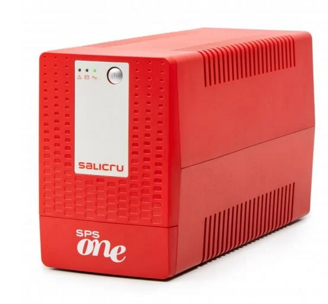
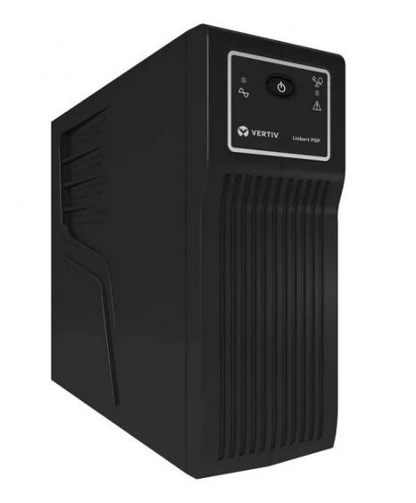

# Calculo del consumo energético.

## Consumo del SAI en casa.

| Unidades |    Equipos | Consumo |VA(factor 1.4)|
|----------|------------|---------|--------------|
| 1        | PC Desktop |  720w   |      -       |
| 1        |   Monitor  |   24w   |      -       |
| 1        |  Impresora |   96w   |      -       |
|     Consumo total     || 840w   |   1176 VA    |
|             Estimación SAI 80%  |||   2117 VA    |
|             Estimación SAI 70%  |||   1999 VA    |
|             Estimación SAI 60%  |||   1882 VA    |

Para este caso particular el SAI a usar que mejor se ajusta a los valores obtenidos es el siguiente:

**https://www.pccomponentes.com/salicru-sps-2000-one-iec-sai-2000va-1200w**

## Consumo del SAI en el instituto.

| Unidades |    Equipos | Consumo |VA(factor  1.4)|
|----------|------------|---------|---------------|
| 1        | PC Desktop |   190w  |       -       |
| 1        |   Monitor  |    26w  |       -       |
||     Consumo total     ||   216w  |    302 VA    |
||             Estimación SAI 80%  ||   543 VA    |  
||             Estimación SAI 70%  ||   513 VA    |
||             Estimación SAI 60%  ||   483 VA    |

Para el consumo del puesto de trabajo en clase es mejor tener un SAI más pequeño que el anterior debido a que requiere de menor potencia.

https://www.pccomponentes.com/vertiv-liebert-psp500mt3-230u-sai-500va-300w

