# Encriptado de archivos con Seahorse

Empezamos instalando Seahorse, pero vemos que tenemos la versión mas reciente ya instalada

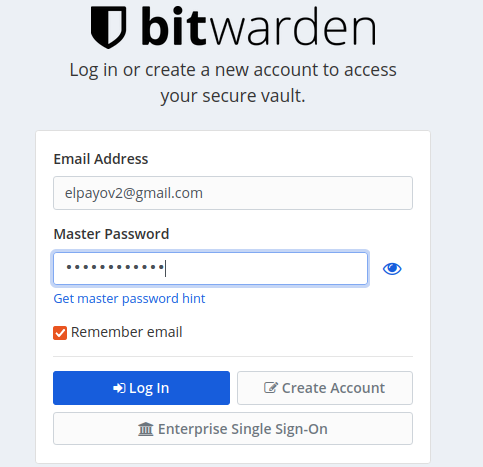

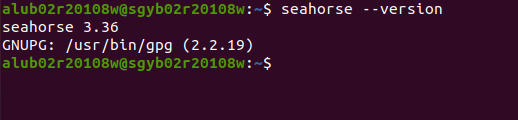

Procedemos a instalar **seahorse-nautilus**.

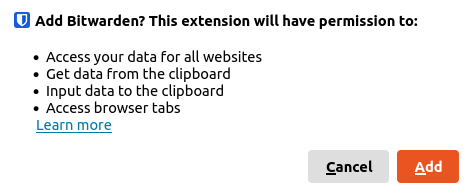

Abrimos **Seahorse**

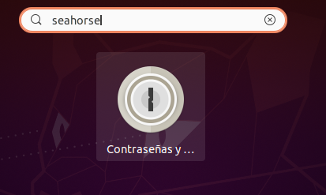

Vemos que hay 4 categorías

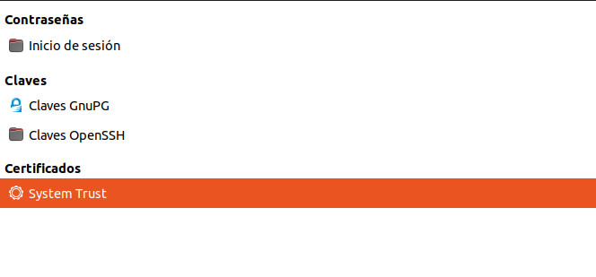

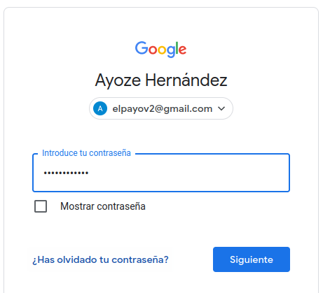

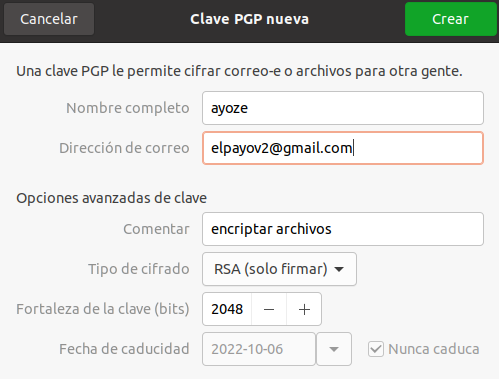

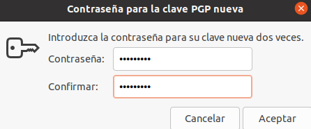

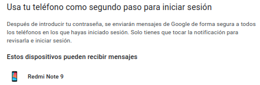

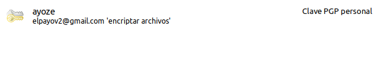

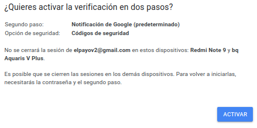

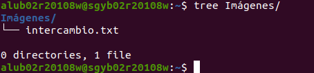

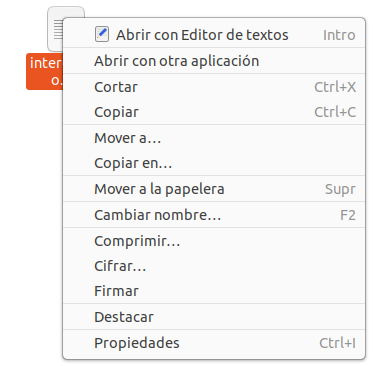

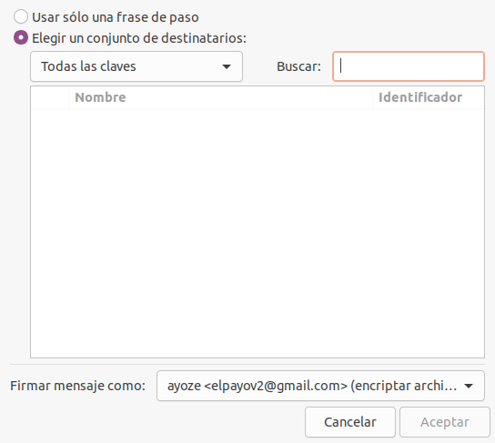

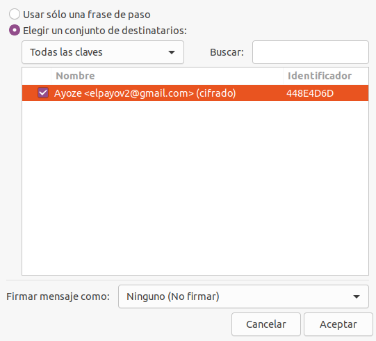

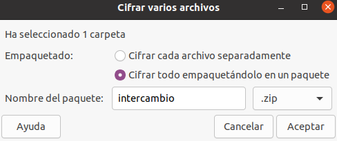

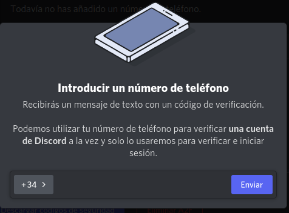
