# Gestor de contraseñas y autentificacion de doble factor con Bitwarden y Authy.

## Gestor de contraseñas con Bitwarden

Empezamos creando una cuenta en Bitwarden


Añadimos un servicio del que queremos guardar la contraseña.

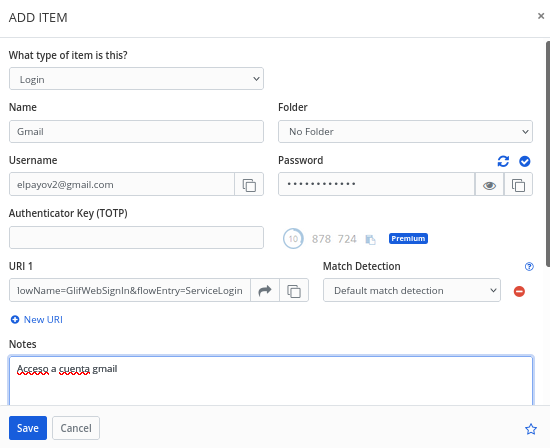

Añadimos la extensión de Bitwarden a nuestro navegador.


Probamos que nos rellena la contraseña de manera automática.

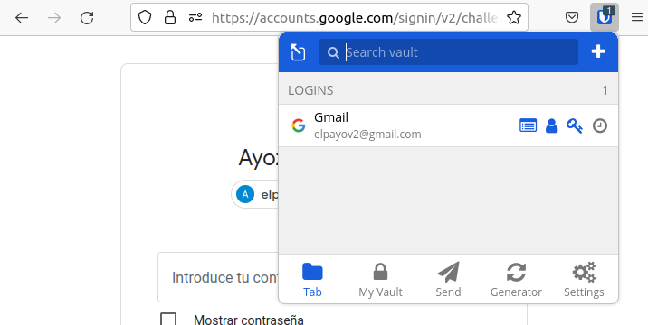


## Autentificacion con doble factor con Authy

Nos dirigimos al apartado de seguridad de nuestra cuenta de Google y vamos al apartado de **verificación en 2 pasos**.


Clicamos en el botón de empezar.

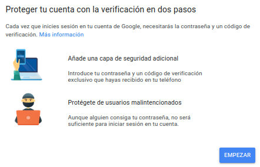

Usamos nuestro teléfono para recibir las notificaciones a la hora de iniciar sesión


Añadimos un medio de seguridad de acceso a nuestra cuenta.

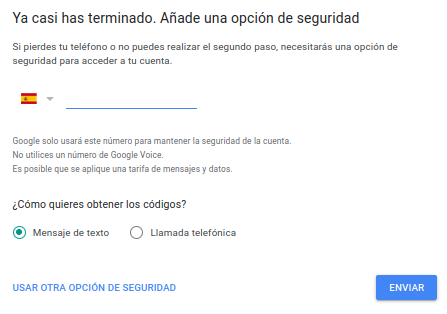

Activamos la verificación en 2 pasos.


Usamos la aplicación de Authy en este paso.

~~~
DISCLAIMER!!!

En el dispositivo móvil no se han podido sacar capturas de este
paso por motivos de seguridad y privacidad establecidos por la
propia aplicación de Authy.

~~~


## Inicion de sesión con Bitwarden y Authy.

Instalamos la aplicación de Bitwarden en el móvil.

~~~
DISCLAIMER!!!

En el dispositivo móvil no se han podido sacar capturas de este
paso por motivos de seguridad y privacidad establecidos por la
propia aplicación de Bitwarden.

~~~

Habilitamos la autentificación de 2 factores, para ello debemos de abrir Authy y escanear el código qr y escribir el código que nos genere en la ultima caja de texto en ```Iniciar sesión con tu código```, lo activamos.

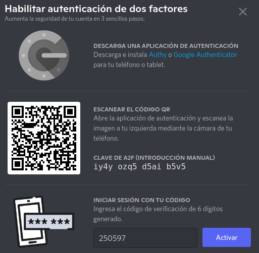

Ahora debemos de asegurar la información de nuestra cuenta añadiendo un número de teléfono.


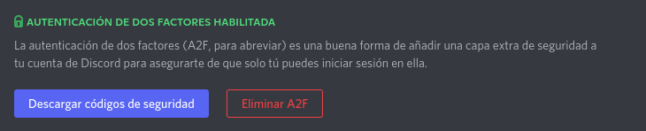

En el teléfono para acceder a Discord de manera casi que automática configuramos el gestor de contraseñas para que pueda copiar las contraseñas a nuestro portapapeles mientras estamos en la pantalla de inicio de sesión.

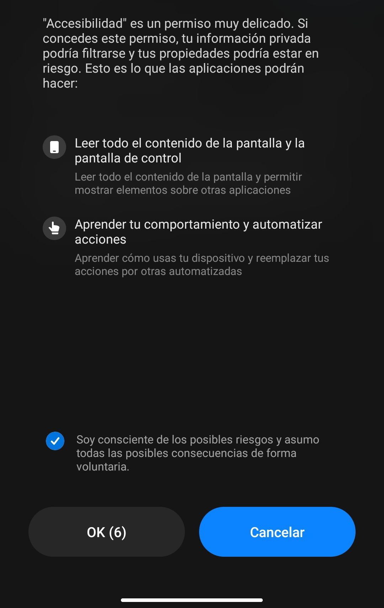

Habilitamos Bitwarden y su acceso directo.

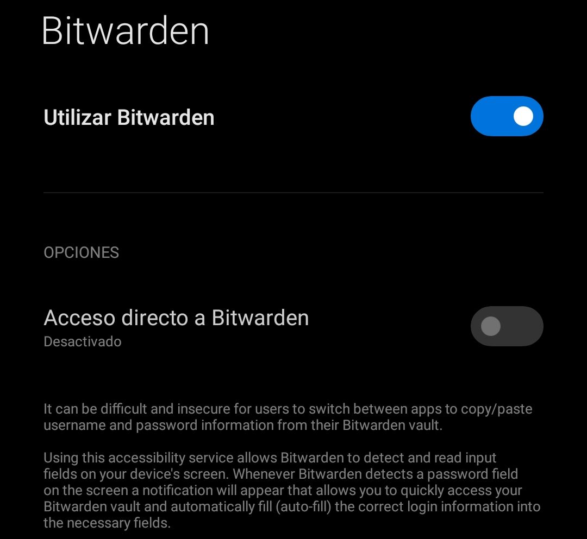

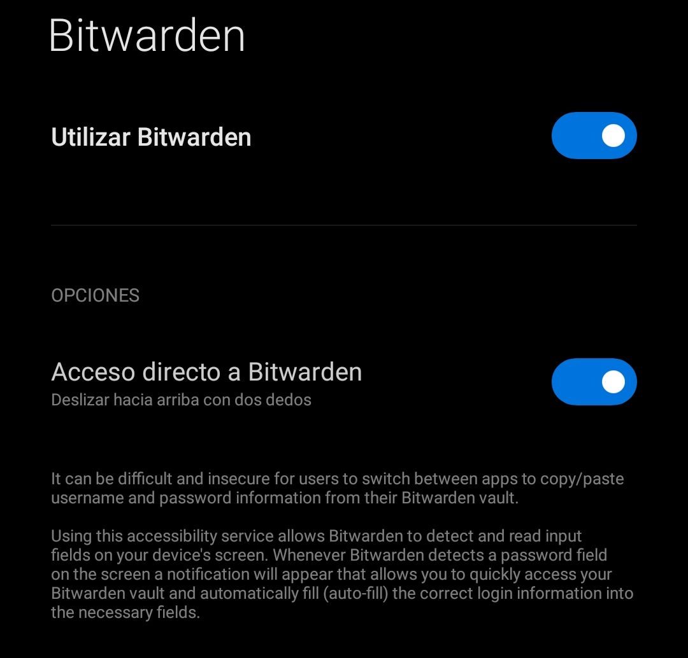

Ahora intentamos iniciar sesión en Discord.

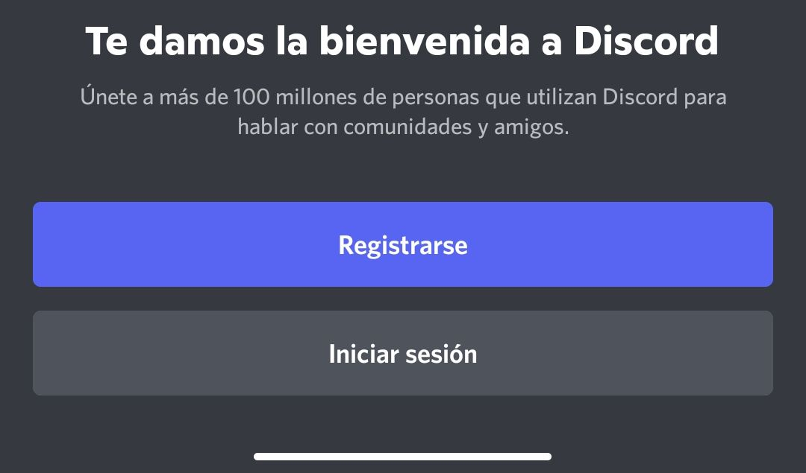

Vemos que en el portapapeles hay algo copiado, esto es la contraseña copiada desde Bitwarden, la pegamos y accedemos.

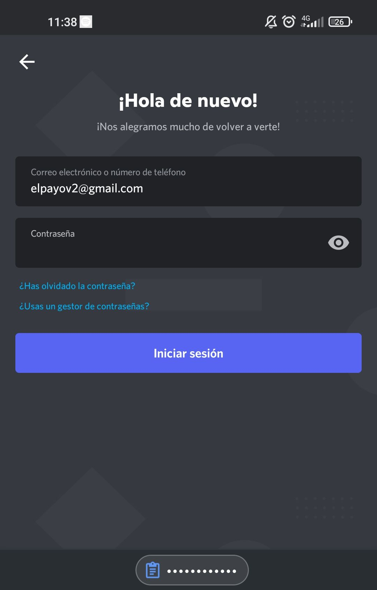

Ahora nos pide un código de 6 dígitos para acceder al fin a nuestra cuenta.

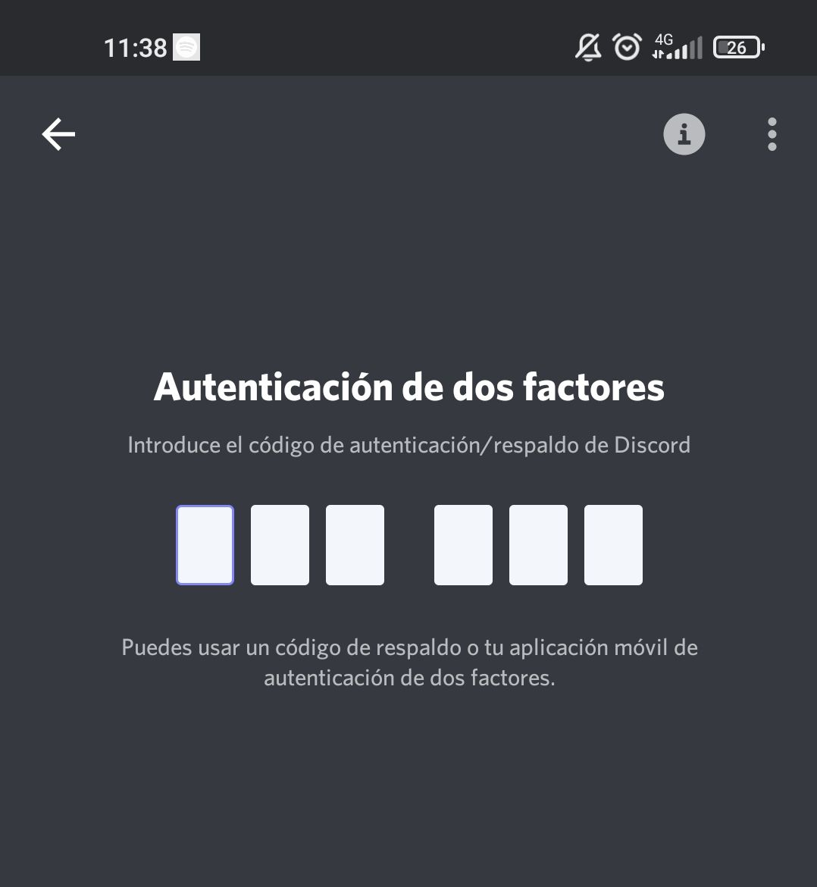
