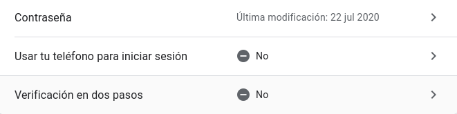
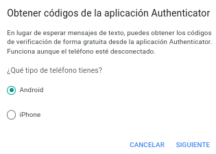
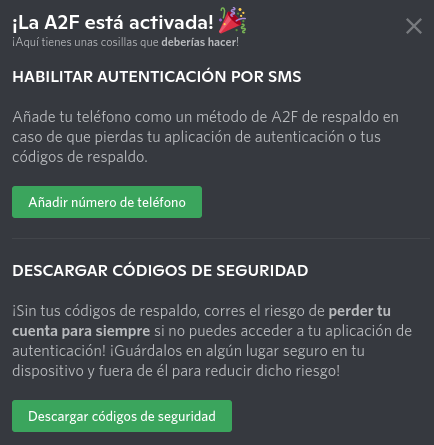

# Encriptado de archivos con Seahorse

Empezamos instalando Seahorse, pero vemos que tenemos la versión mas reciente ya instalada

Procedemos a instalar **seahorse-nautilus**.

Abrimos **Seahorse**

Vemos que hay 4 categorías

