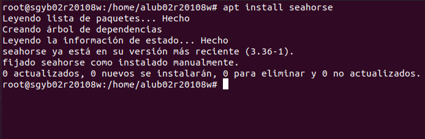

# Encriptado de archivos con Seahorse

##Instalación

Empezamos instalando Seahorse, pero vemos que tenemos la versión mas reciente ya instalada

Por lo que podemos comprobar la versión.

Procedemos a instalar **seahorse-nautilus**.

Ahora debemos de crear un archivo que vamos a encryptar.

Debemos de llenarlo minimamente para que nos pueda mostrar algo.

Nuestro compañero nos pasa su fichero encryptado y probamos a ver que tiene, para ello debemos ejecutar el comando **gpg -d swap.txt.gpg** para poder desencriptarlo con la clave que nos pasa nuestro compañero.

Ahora introducimos la frase de paso.

Nos sale en el terminal el contenido del fichero, en este caso es **Hola payo!**

