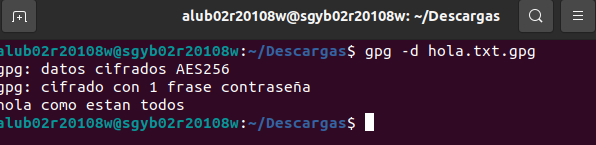

# Encriptado de archivos con Seahorse

##Instalaciod

Empezamos instalando Seahorse, pero vemos que tenemos la versión mas reciente ya instalada

Procedemos a instalar **seahorse-nautilus**.

Abrimos **Seahorse**

Vemos que hay 4 categorías. Arriba a la derecha hay un simbolo de ``+``, o pulsamos y se nos abre un panel con distintas opciones.

En este panel debemos de seleccionar la primera opción para crear una clave que nos encripte los archivos.

Rellenamos los datos necesarios para tener una clave completa.

E inventamos una clave para el encriptado.

Ahora nos encontramos en la pantalla de antes, si quisieramos ver nuestra clave debemos de ir a **Claves GnuPG**.

Aqui vemos nuestra clave

Podemos exportarla por seguridad.

## Encriptado de archivos

Creamos un archivo **intercambio.txt** que mandaremos a un compañero para que intente desencriptarlo con la clave que generaremos.

Hacemos click derecho sobre este y vemos que casi al final nos sale una opción para cifrar, pinchamos ahí.

Ahora debemos firmar nuestro fichero con la clave PGP que creamos antes.

Al usar una frase de paso añadimos un punto más de seguridad a nuestro archivo.

Añadimos la frase de paso.

Ahora para terminar debemos de escribir nuestra clave de encriptado.

## ¿El compañero puede descifrarlo?
