# Clonación de discos con clonezila

#### Clonacion desde un disco a otro o una partición del mismo.

##### Preparativos.

Empezamos creando una partición a un disco nuevo en el particionador de Yast de OpenSUSE.

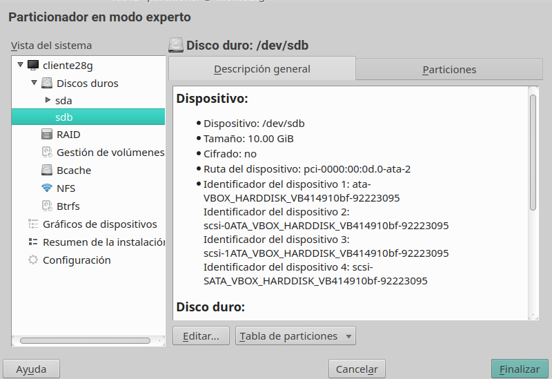

Elegimos que la particion sea para datos y aplicaciones

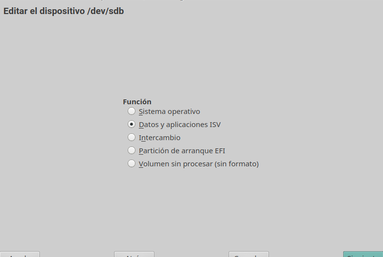

Formateamos el disco con un formato adecuado

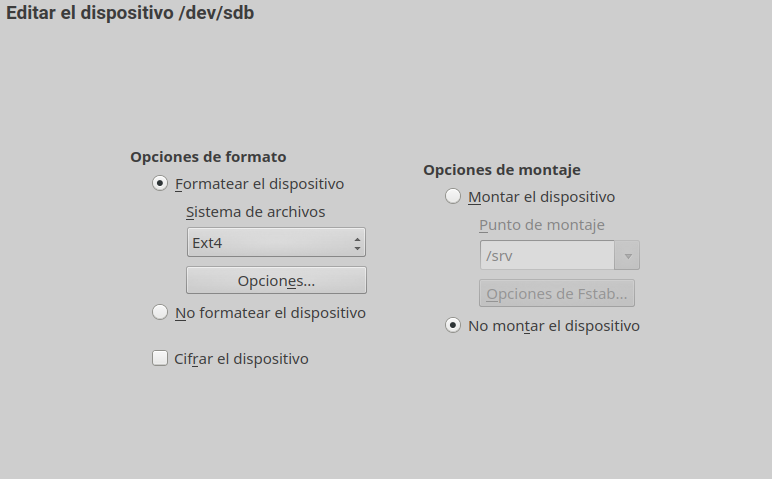

Elegimos el tamaño de las particiones y una vez echo esto apagamos la máquina.

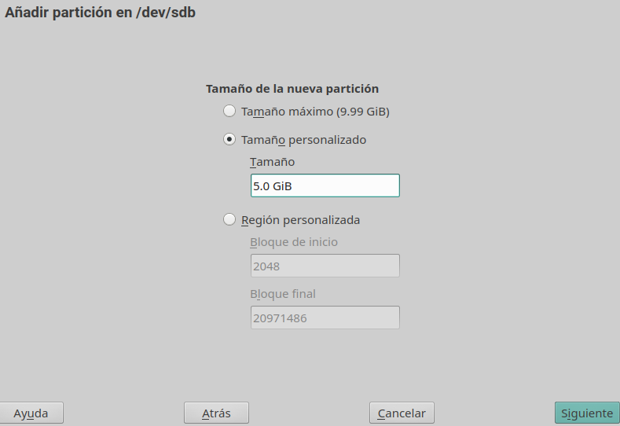

##### Clonación de discos

Ahora encendemos la propia máquina, pero le añadimos la ISO de clonezila.

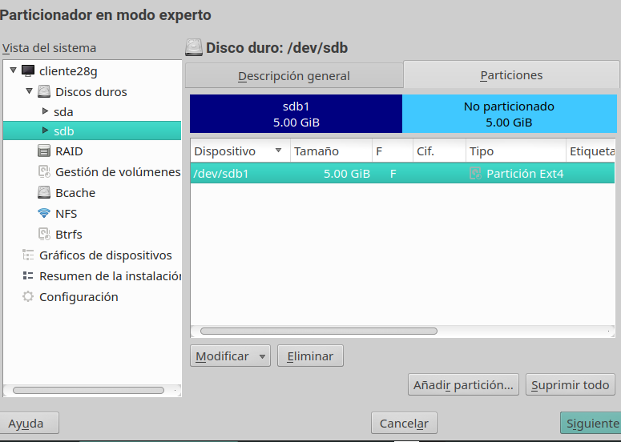

Empezamos a elegir las opciones de nuestro teclado, en mi caso lo puse en español y no toqué nada del mapeado del mismo.

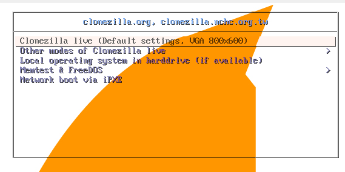

Aquí, como queremos clonar de un disco a otro debemos de elegir la segunda opción **"device-device"**.

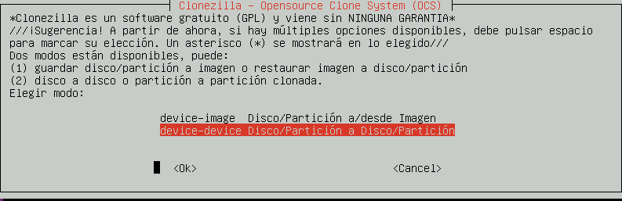

Elegimos el modo principiante.

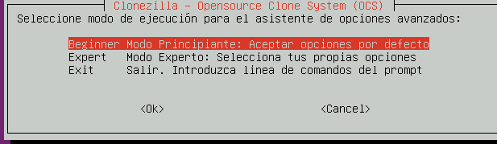

Elegimos la opción de disco local a disco local.

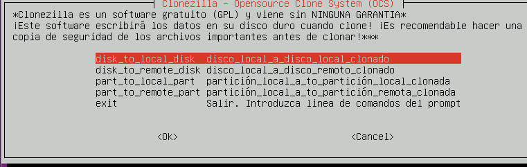

Elegimos el segundo disco.

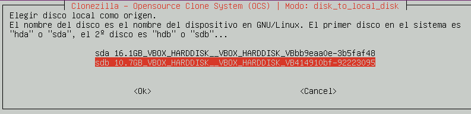

Siguiente.

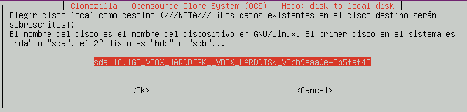

Elegimos la opción del medio si queremos comprobar que realmente se ha creado la copia.

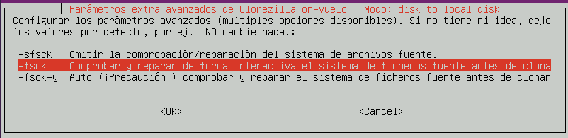

Elegimos que reinicie después de realizar el clonado de disco.

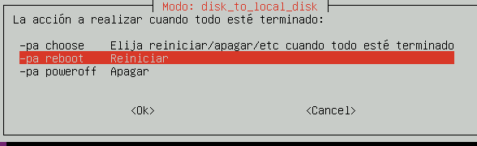

Al realizar el paso anterior nos devuelve el siguiente texto que deberemos de aceptar.

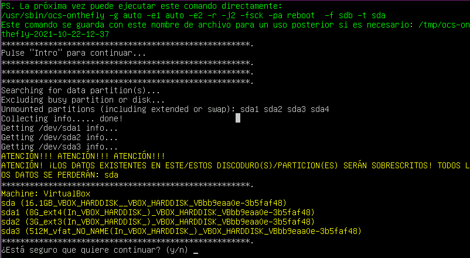

Ahora nos devuelve información de como va la clonación de discos.

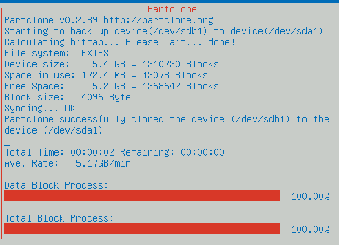

## Clonacion de discos: SSH

Empezamos desde el principio eligiendo la opción device-image.

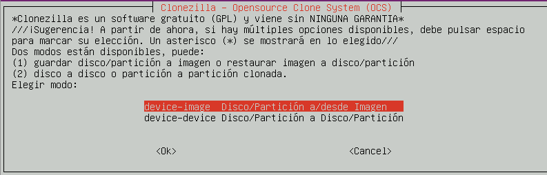

Selecionamos la opcion ssh_server para clonar el disco desde la maquina a un servidor **ssh**.

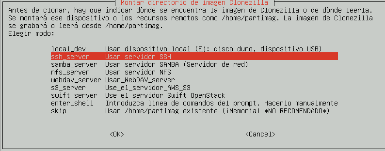

Seleccionamos la opción de dhcp para que nuestra maquina adopte una ip de manera automática.

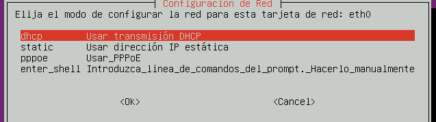

Elegimos la ip de la maquina que vamos a usar como servidor ssh.

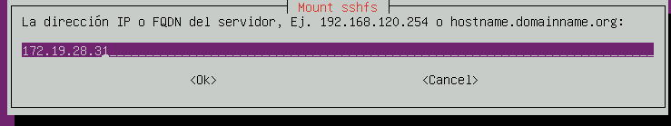

Aquí nos pregunta por el puerto por el que realizará la conexión ssh para enviar la copia de nuestros datos a la máquina servidor.

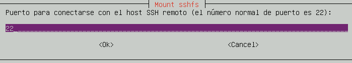

Ahora elegimos un usuario al que se accederá a la máquina servidor remota.

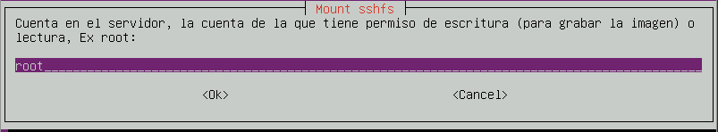

Elegimos una ruta para la clonación de nuesto disco. Después de esta ventana nos aparece una ventana de confirmación.

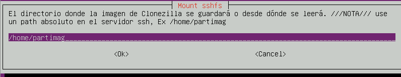

Ahora introducimos la contraseña de root.

~~~

Como no hemos creado la carpeta /home/partimag nos
devuelve 2 errores, después del segundo me di cuenta y cree la carpeta

~~~

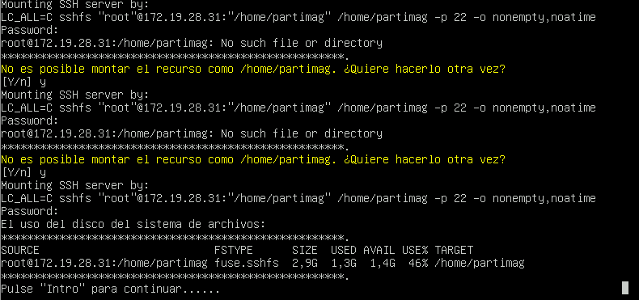

Vemos la creación de la carpeta partimag en **/home**.

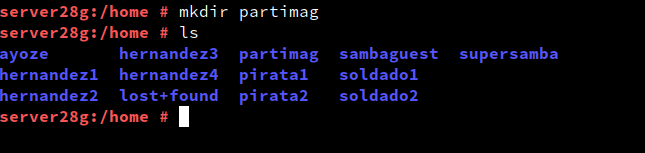

Ahora debemos de introducir el nombre de nuestra imagen.

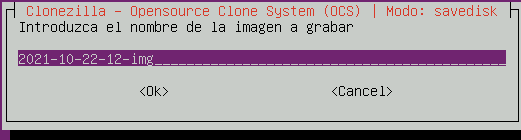

Seleccionamos el segundo disco como punto de origen de la copia.

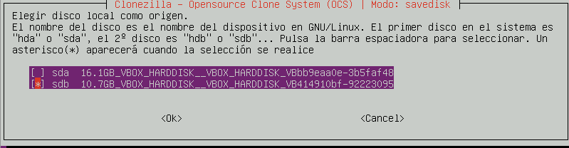

Guardamos la imagen clonada.

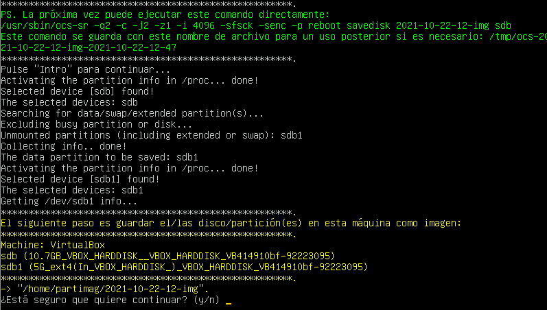

Ahora nos devuelve información sobre el proceso de la clonación de la imagen.

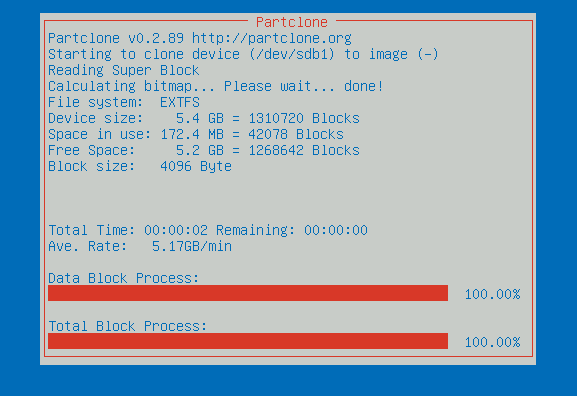

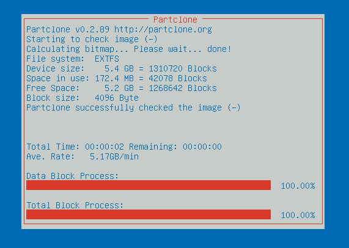
