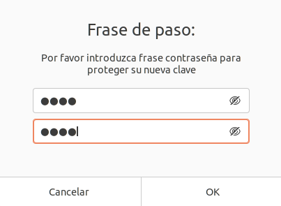

# Cifrado asimétrico con GPG

## Creación de claves

Empezamos creando un par de claves **publico/privada**.

`` gpg --full-generate-key ``

A continuacion nos saldrán varias preguntas, las deberemos responder de la siguiente manera.

* Debemos seleccionar una clave de tipo RSA y RSA escribiendo el número 1.

* Especificamos que el tamaño de la clave sea de 4096 bits de longitud.

* Especificamos que la clave nunca caduque con el 0 y confirmamos nuestra elección.

* Ahora debemos aceptar que la clave que acabamos de crear es la que queremos con la opción **(V)ale**.

Ahora debemos de generar entropía dentro del ordenador para generar bytes aleatorios, es decir, generar "caos" dentro del pc para que se puedan ejecutar los calculos necesario para la generación de la clave.

Se nos pide una frase para securizar la clave.

Ahora visualizamos la clave recién creada con **gpg -k**.

Ahora exportamos la clave a un fichero con formato ***.gpg.asc*** y se la pasamos a un compañero para que cifre archivos y nos los pase para descifrarlos más tarde.

## Cifrado de archivos

Para empezar a cifrar debemos de importar la clave de nuestro compañero de la siguiente manera.

Ahora debemos de crear un archivo que contenga algo de contenido para cifrarlo y pasarlo a nuestro compañero.

Ahora encriptamos/ciframos el archivo con el comando siguiente.

``gpg -a -r salgocu@gmail.com --encrypt holasalva.txt``

## Descifrar archivos

Ahora recibimos un archivo cifrado que ha sido creado por el **compañero** con la **clave pública nuestra**.

Para ver el contenido del archivo debemos de hacer lo siguiente. Usaremos el comando ``gpg-a --decrypt wolpayo.txt.asc > wolapayo.txt`` con esto descifrarmos el archivo y exportamos su contenido a un **txt**.

Introducimos **nuestra clave de paso**.

Abrimos el fichero y vemos el contenido de este.

## Alojamiento de claves en un servidor de claves públicas (Red Iris)

Ahora debemos de repetir los pasos para la generacion de un par de claves publico/privada y la exportamos.

Ahora nos dirigimos a la siguiente página: [Red Iris](https://www.rediris.es/keyserver/). Aquí debemos de introducir el contenido de la clave en el cuadro de texto que aparece al final de la página (Hacemos un cat de la clave exportada y copiamos el contenido)

Nos sale una advertencia de la propia página de Red Iris que nos advierte que la informacion enviada se envía por una conexión no segura, debemos de aceptar si queremos subir nuestra clave al servidor de claves públicas.

Vemos que se ha añadido la clave al servidor.

Ahora buscamos nuestra clave y vemos que se encuentra alojada.

Aquí vemos el resultado de la busqueda.

