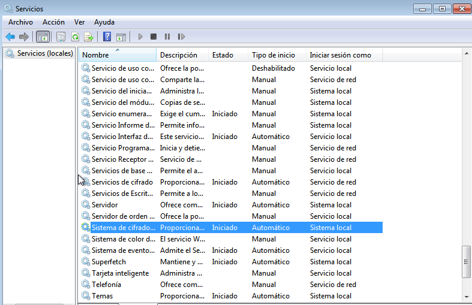

# Cifrado de archivos en Windows 7 y Windows 10

## Cifrado de archivos en Windows 7.

### Creación de usuarios.

Nos dirigimos a Panel de control → Cuentas de usuario y protección infantil → Control parental → Crear nueva cuenta de usuario.

Creamos los usuarios normal y encriptado

Ahora con los usuarios creados debemos de otorgarles permisos de administrador.

Iniciamos sesión con cada uno de ellos y cambiamos el tipo de cuenta de **Usuario estándar** a **Administrador**.

### Activación del servicio de "Sistema de cifrado de archivos (EFS)"

Debemos de teclear el "Shortcut" **Win + R** y escribir services.msc y buscamos el servicio llamado **"Sistema de cifrado de archivos EFS"** y lo activamos e iniciamos.

### Cifrado de archivos.

Para crear certificados de cifrado debemos de acceder a la utilidad de cifrado de archivos y seguir los pasos guiados por la interfaz.

Guardaremos el certificado dentro de la carpeta certs dentro del disco duro C.

Seleccionamos la opción de actualizar los archivos de cifrado más tarde.

Vemos un resumen del certificado de cifrado para archivos.

Ahora debemos de entrar como usuario **enciptado** y debemos de crear una carpeta de nombre **encriptar** y añadimos un fichero de nombre **hola** dentro de esta para que tenga algo de contenido.

Vemos que tanto los archivos dentro de la carpeta como esta misma nos tienen las letras de color verde.

Si intentamos quitar el cifrado de esta carpeta no podemos aunque seamos administradores.

Vemos que tampoco podemos deneter el servicio de Sistema de cifrado de archivos (EFS)

Vemos que si intentamos editar el fichero tampoco nos lo permite.

## Cifrado de archivos en Windows 10.

### Creación de usuarios.

Empezamos creando los usuarios **encriptado** y **normal** con sus contraseñas respectivas.

Les damos permisos de administrador a estos.

### Activación del servicio de "Sistema de cifrado de archivos (EFS)"

Para activar el cifrado de archivos EFS de otra manera se puede ir a **Directivas d egrupo local** y activarla siguiendo las siguientes 5 imágenes.

### Cifrado de archivos.

Ahora creamos en C la carpeta encripar y le añadimos dentro un archivo llamado hola.

Al aceptar el cifrado se nos genera un certificado de cifrado. Seguimos los pasos por defecto.

Seleccionamos una ruta para guardar el certificado.

Vemos un resumen de la exportacion del certificado.

Vemos que ahora si está cifrada la carpeta.

Vemos que al intentar acceder a este y vemos que nos niega el acceso.

Si intentamos desactivar el servicio vemos que no podemos.

