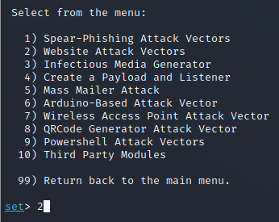

# Phishing con SET (Social Engineering Toolkit)

## Introducción

La herramienta que vamos a usar en esta practica se llama SET o Social Engineering Toolkit. Con ella podemos realizar una gran cantidad de ataques a la máquina cliente de windows 7 que tenemos preparada, pero en esta nos centraremos en el phishing, es decir capturar contraseñas y usuarios en sitios como facebook, reddit, ultimainformatica...

## Herramienta

Empezamos abriendo la herramienta.

Este es el panel inicial de la herramienta, elegimos las opciones 4 y 5 para actualizar la herramienta.

Ahora que está actualizada la herramienta, elegimos la opción 1 (Social-Engineering Attacks)

Dentro de la opción 1 se nos presentan aún más opciones, pero solo vamos a usar la segunda, es decir Website Attack Vectors.

Elegimos la opción 5 para atacar a los sitios web.

Elegimos la segunda opción 2 para clonar los sitios web.

La primera vez nos sale el siguiente aviso. Después de este nos solicita una IP, podemos dejar este espacio en blanco, ya que queremos nuestra que nuestra máquina almacene los ficheros de configuración de las páginas clonadas o bien podemos poner una ip de destino.

Elegimos la página de login de Facebook.

## Facebook

Una vez le demos enter a la url, debemos de ir a un navegador y poner la ip 127.0.0.1 en la barra de busqueda y nos saldrá lo siguiente, debemos de acceder a esa url nueva para ver la página clonada.

Vemos que nos muestra en pantalla una copia exacta de la página de Facebook. Introducimos tanto usuario como contraseña falsos.

Vemos que nos salen el usuario y contraseña falsos.

Vemos que el archivo con esta información se guarda en **/root/.set/reports**.

### Facebook desde el víctima.

Hacemos lo mismo desde la máquina víctima para comprobar que funciona.

La página se ve media extraña en el navegador, pero es porque el navegador es antiguo.

Vemos que nos sale la contraseña y usuario en el reporte que nos da al ejecutar la herramienta.

Vemos que nos salen la contraseña y el usuario en el archivo.

## Reddit

Repetimos el mismo proceso con la página de reddit.

Vemos que la página de reddit luce extraña (letras que tengan tildes).

Vemos que nos pilla la contraseña y el usuario.

## Ultima Informática.

La página de login de Ultima Informática luce así.

Repetimos el proceso aquí y vemos que nuestra página luce exactamente igual a la página real. Introducimos usuario y contraseña.

Vemos que en el reporte nos sale tanto el usuario y contraseña.

