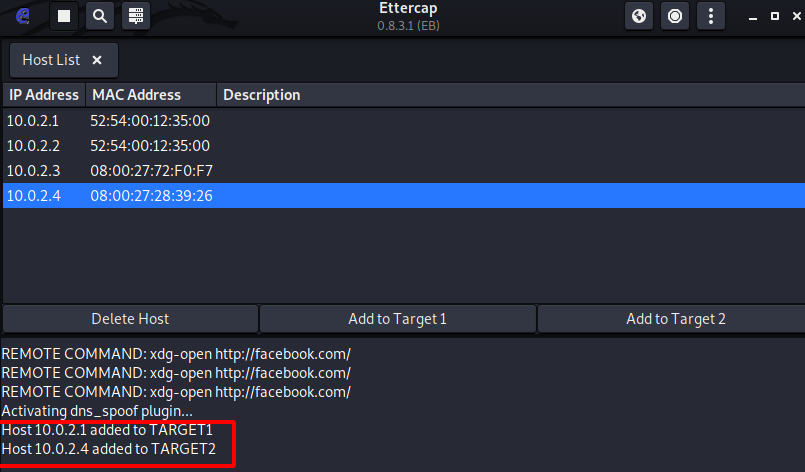

# DNS SPOOFING

Empezamos abriendo la herramienta ettercap-graphical


En el lateral derecho abrimos los 3 puntos y buscamos la categoría hosts, nos metemos en ella y elegimos la opción de Scan for hosts.


Esperamos a que termine el escaneo de los hosts y añadimos a target1 la máquina que queremos atacar, y a target2 el router que estemos usando.


Volvemos al lateral derecho, pero esta vez hacemos click en el icono del globo terráqueo y elegimos la opción ARP poisoning.


Nos sale el siguiente cuadro, aceptamos.


Ahora debemos de volver al lateral derecho y, otra vez en los 3 puntos elegimos la categoría de manage plugins y activamos el plugin llamado remote_browser.


Ahora, en la máquina cliente accedemos a cualquier sitio y se nos muestra en la máquina servidor, facebook es un ejemplo.


En la máquina servidor, en la interfaz de ettercap-graphical nos sale información de los sitios a los que se van accediendo desde la máquina victima.


## Man In The Middle

```
NOTA: Esta sección de la práctica se hizo otro día diferente con una interfaz de
red de red NAT.
```

Añadimos ahora el router a target1 y el equipo que sufrirá el ataque a target2.



Ahora debemos de acceder mediante el terminal al fichero /etc/ettercap/etter.dns y añadir las siguientes líneas, esto hace que nos pongamos como dns de la máquina víctima.


Nos dirigimos al panel de ettercap-graphical y activamos el **plugin dns_spoof**.


Volvemos a activar el ARP poisoning.


Ahora recrearemos de nuevo la práctica de clonación de sitios en este paso y duplicaremos el sitio de facebook, para más detalles de la práctica de la que se habla, revise la práctica 1 de la unidad 3.

Vemos que cuando queremos acceder a facebook mediante la url correcta, nos redirige al documento creado por la máquina kali.


Vemos que nos muestra información de los sitios que se visitan de nuevo


Y vemos que cuando se introducen datos en los campos de inicio de sesión salen en el panel de ettercap-graphical.


