# Explotar vulnerabiidades.

### Explotando vulnerabilidades con Metasploit Framework MYSQL.

Comprobamos que la máquina tiene el puerto 3306 abierto con la utilidad msfconsole ejecutando el comando db_nmap.

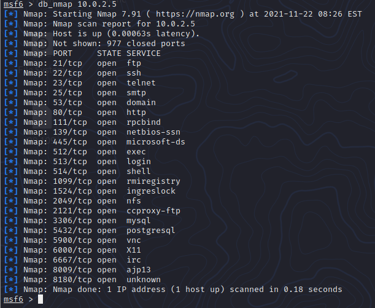

Buscamos información del puerto y entramos.

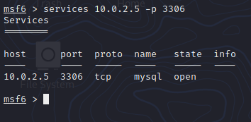

Entramos a la base de datos con la línea mysql -u root -p --host=10.0.2.5 --port=3306

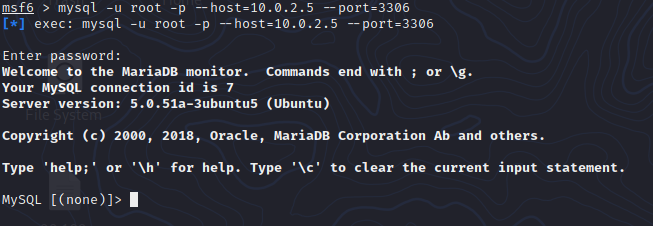

Extraemos la información de los usuarios con tarjetas de crédito.

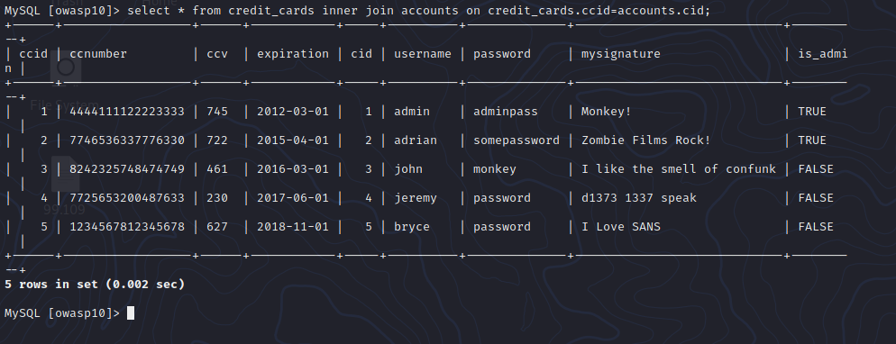

### Explotando vulnerabilidades con Metasploit Framework VSFTPD.

Consultamos el estado e iniciamos el servicio de postgresql.

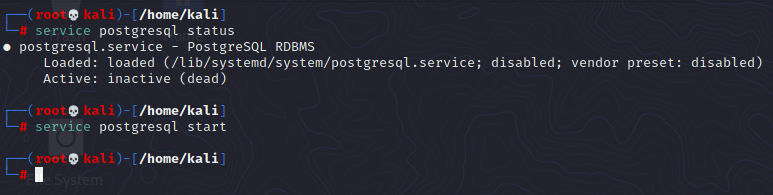

Iniciamos la herramieta msfconsole.

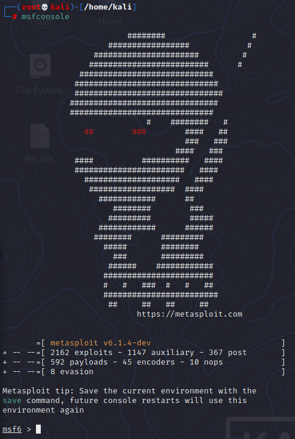

Hacemos un **db_nmap 10.0.2.5 -p 1-65535** para hacer un escaneo de todos los puertos de la máquina víctima.

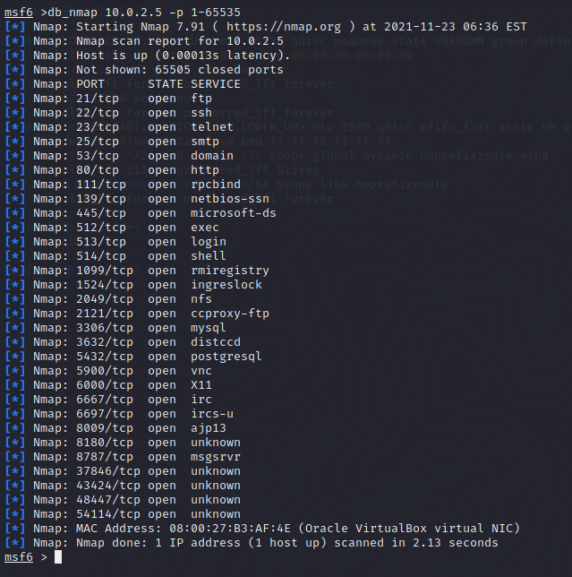

mostramos un lstado de los hosts que se han escaneado recientemente, aparece, además de la máquina Metasploit de Windows (HERNANDEZ28WSGY) y la máquina del profesor (AMARZAR-PC), aparece la máquina victima con una ip=10.0.2.5.

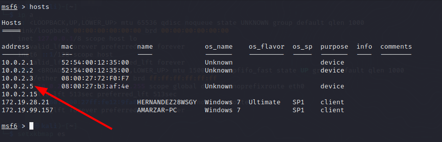

Vemos los servicios de la máquina víctima con services 10.0.2.5.

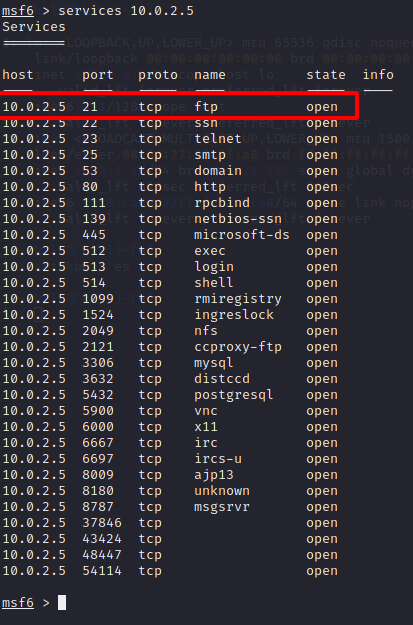

Ejecutamos vulns para ver las vulnerabilidades que se han detectado en la máquina.

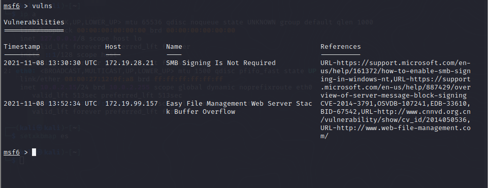

Ahora hacemos un db_nmap -sV 10.0.2.5 -p 21 para revelar más información sobre los servicios relacionados con los puertos abirtos, vemos que se nos proporciona más información sobre el puerto 21 que está abierto para conexiones ftp.

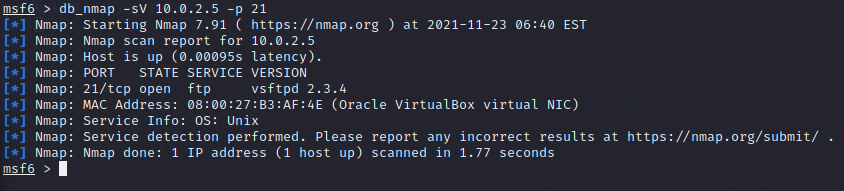

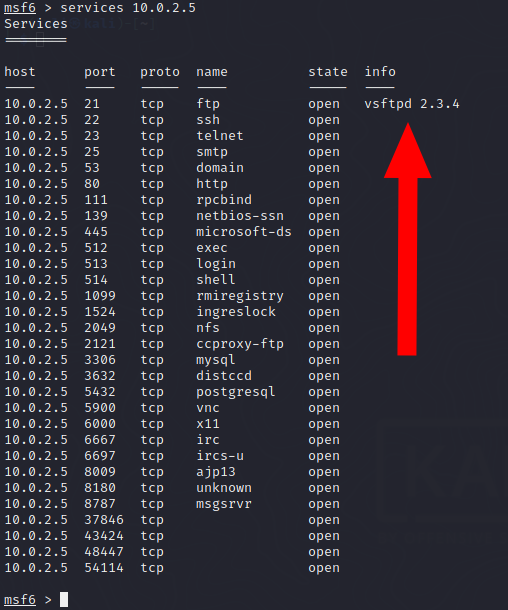

Buscamos exploits relacionados con la información proporcionada por el puerto.

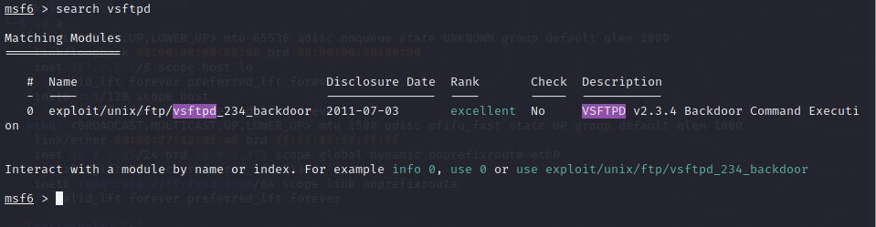

Usamos el exploit y cambiamos el RHOST a 10.0.2.5 y lo ejecutamos.

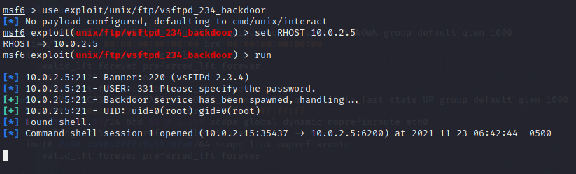

Ahora nos encontramos dentro de la máquina, ahora podemos apagarla si queremos.

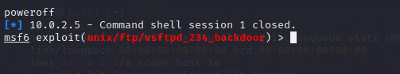

Vemos que se apaga la máquina víctima.

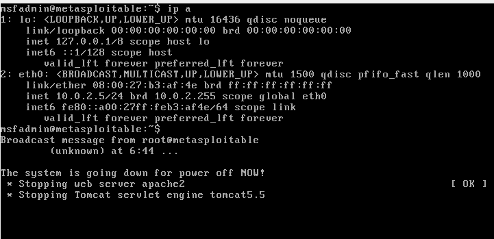
