# Hackeo de Windows, ejecución del modo comando desde Kali Linux

En la máquina Windows victima abrimos un servidor de ficheros http por el puerto 8080.

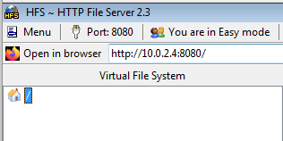

Comprobamos con un nmap que está abierto.

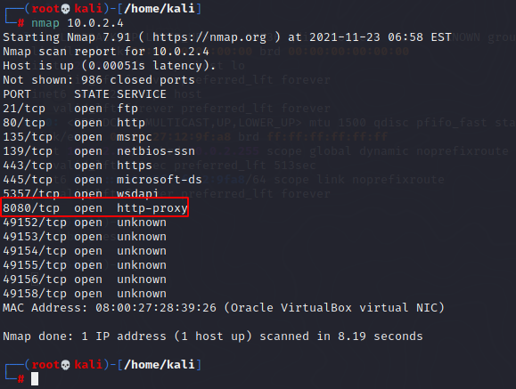

Accedemos al servidor HTTP mediante un navegador con la ip de la máquina victima y con el puerto anterior, es decir, buscamos 10.0.2.4:8080 en el navegador.

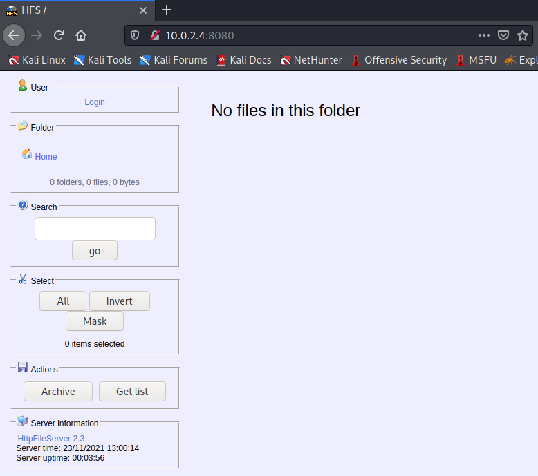

Vemos la version del server en la parte de abajo a la izquierda.

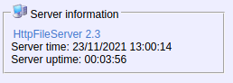

Ejecutamos la herramienta **msfconsole** y buscamos sobre el httpfileserver para comprobar si hay vulnerabilidades que podamos usar, y vemos que hay una.

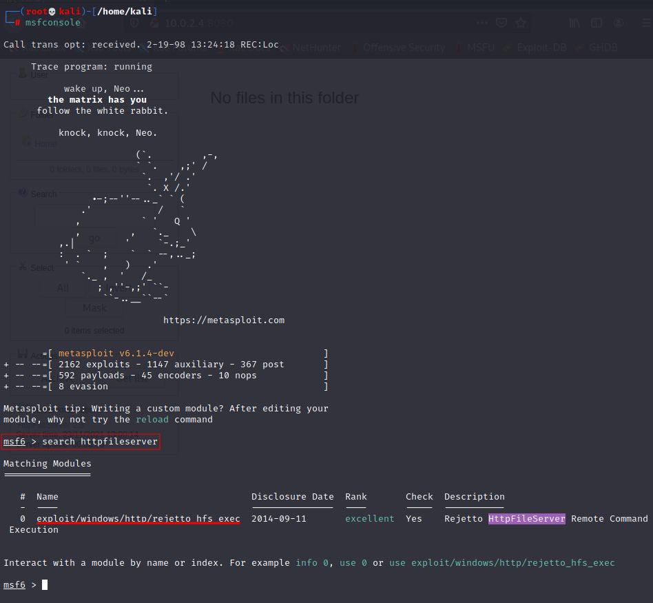

Usamos esa debilidad.

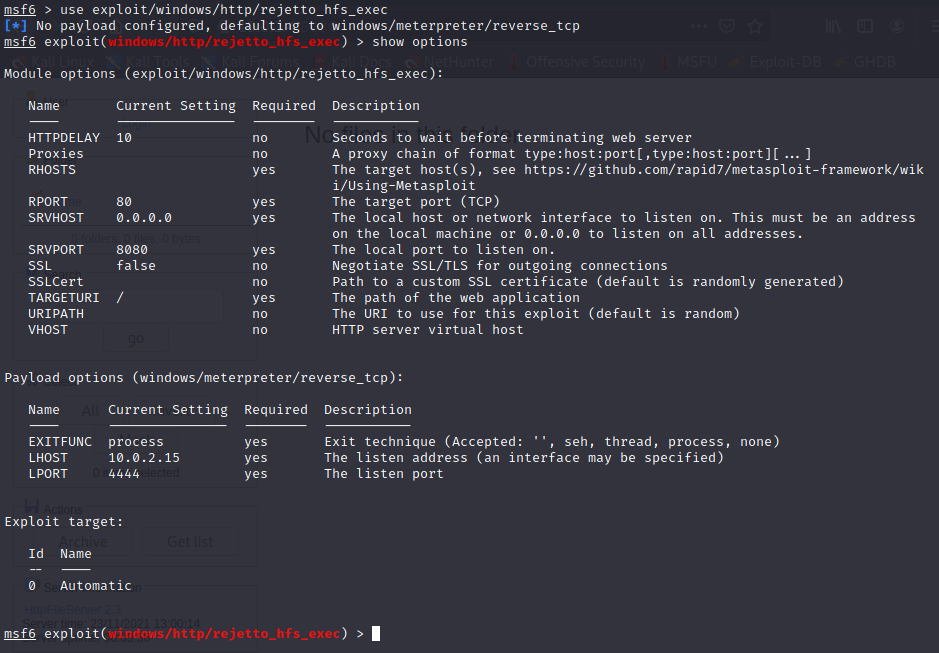

Cambiamos el puerto y el RHOST de la máquina atacante y ejecutamos el exploit.

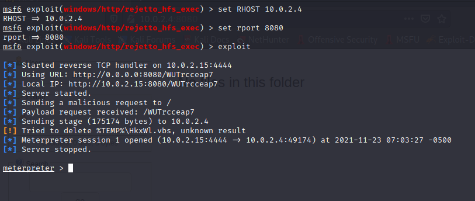

Vemos en el servidor HTTP que alguien ha entrado.

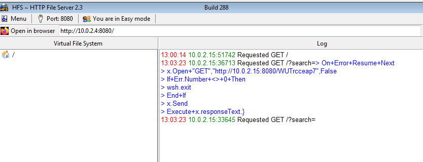

Obtenemos el id de usuario actual y vemos que hay en el directorio en el que estamos.

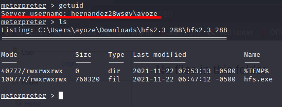

Ahora sacamos una captura de pantalla del escritorio de la victima con el comando screenshot.

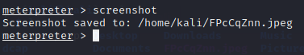

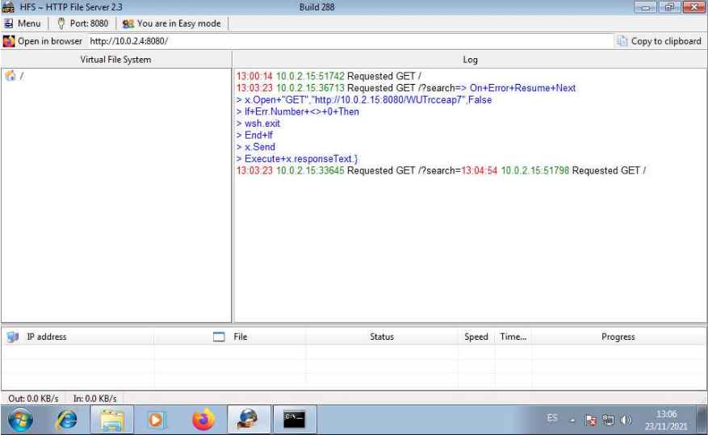

Desde el equipo vulnerable subimos un archivo **prueba.txt**.

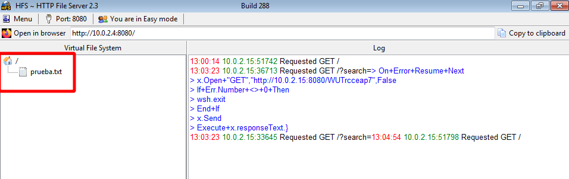

Desde la máquina kali descargamos ese fichero.

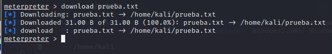

Vemos el contenido del fichero.

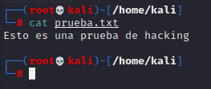

Abrimos el cmd con **shell** y ejecutamos comandos de Windows, por ejemplo dir para visionar el contenido del directorio.

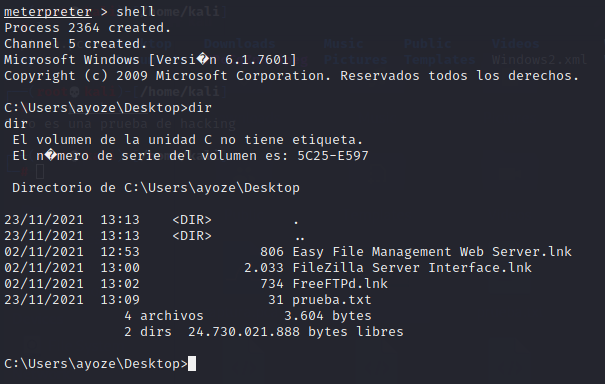

Desde la máquina kali, fuera de la shell, ejecutamos **idletime** para ver el tiempo que lleva iniciada la sesión del usuario. Con **sysinfo** vemos información del sistema. Y con **upload** podemos subir un fichero o carpeta a la víctima.

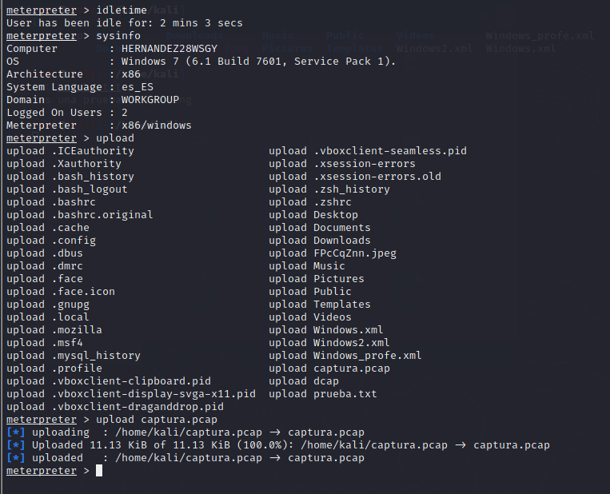

Buscamos el fichero prueba.txt desde meterpreter, ejecutamos el notepad de windwos y buscamos la tabla de rutas.

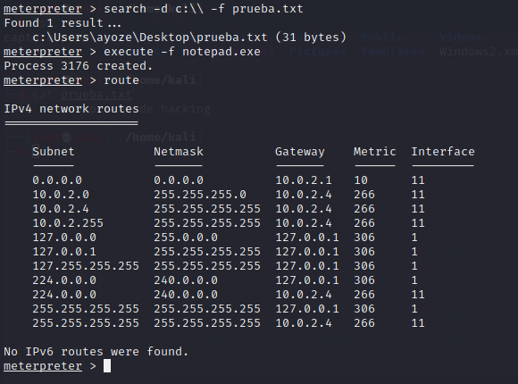

Ahora apagamos la máquina en 10 segundos.

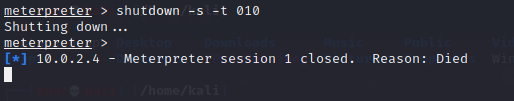
