

# Hack Windows usando TCP reverse.

***Nombre:*** Ayoze Hernández Díaz

***Curso:*** 2º de Ciclo Superior de Administración de Sistemas Informáticos en Red.

### ÍNDICE

+ [Introducción](#id1)
+ [Objetivos](#id2)
+ [Uso de msfvenom](#id3)
+ [Sesión meterpreter](#id4)
+ [Conexión](#id5)

#### ***Introducción***. 

En esta práctica se van a usar las herramientas de Kali Linux para intentar colar un troyano en Windows 7/10.

#### ***Objetivos***. 

El objetivo es que, mediante el uso de msfvenom y msfconsole podamos abrir una sesión de meterpreter en la máquina de Windows y tener acceso desde Kali.

#### ***Uso de msfvenom***. 

Con msfvenom podemos generar un archivo **install_adobe.exe** que será el detonante de la sesión meterpreter, para ello debemos de ejecutar el siguiente comando mostrado en la imagen.

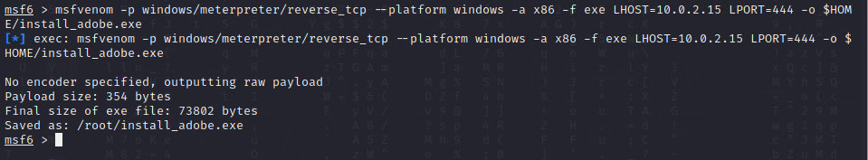

Vemos que el archivo se ha generado el la ruta **/root**.

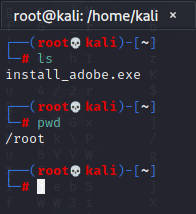

Podemos hacer que el archivo sea menos detectable por páginas como [**Virus Total**](https://www.virustotal.com/gui/home/upload) con la siguiente linea de comando.

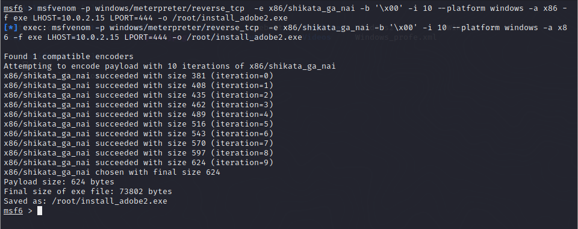

Vemos que se ha generado un **install_adobe2.exe**.

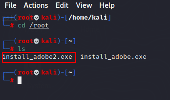

#### ***Sesión meterpreter***. 

Para poder abrir la sesión meterpreter debemos de encontrar alguna manera de pasar el archivo "bichado" a la máquina target/objetivo/víctima. Para ello haremos uso del programa **hfs** (HTTP File Server) usado en la práctica anterior de la misma manera.

En las siguientes imagenes se puede ver el proceso a seguir para que se pueda pasar el archivo mediante este tipo de servicio. Para ello debemos de usar el multi/handler y usar el payload adecuado (**windows/meterpreter/reverse_tcp**) además debemos de especificar la Ip (LHOST) como el puerto de escucha de la máquina atacante.  

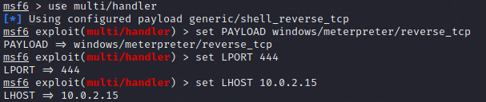

Además de lo ya mencionado debemos de especificar la Ip de la máquina target/objetivo/víctima como el puerto por el que escucha el servicio de hfs. Una vez configurado todo debemos de **"explotar"** la máquina atacada.

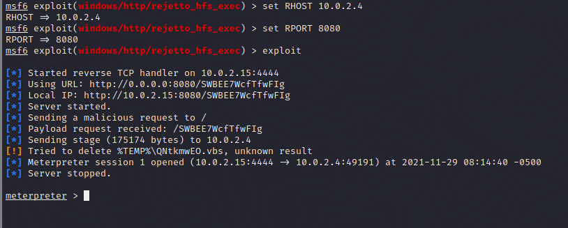

Ahora nos interesa subir el archivo install_adobe2.exe, por lo que hacemos un upload del archivo a la máquina target/objetivo/víctima.

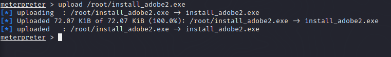

Vemos que dentro de la ruta de la herramienta hfs se encuentra el ejecutable de **install_adobe2.exe**.

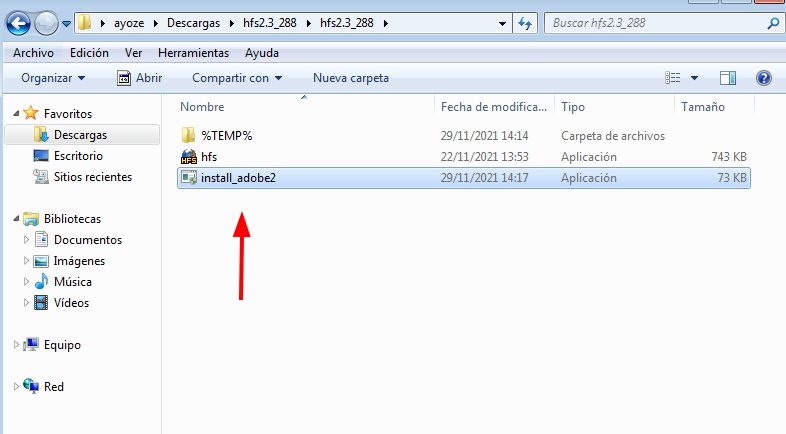

#### ***Conexión***. 

Para poder conectar con la máquina que queremos atacar debemos de ejecutar el programa install_adobe2 en la máquina de Windows.

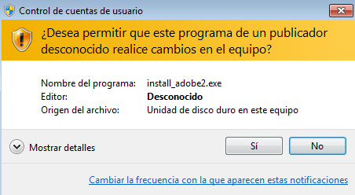

Usamos una sesión meterpreter como la anteriormente usada para subir el archivo, pero no especificamos parametros del lado de la víctima. Vemos que nos conectamos con éxito.

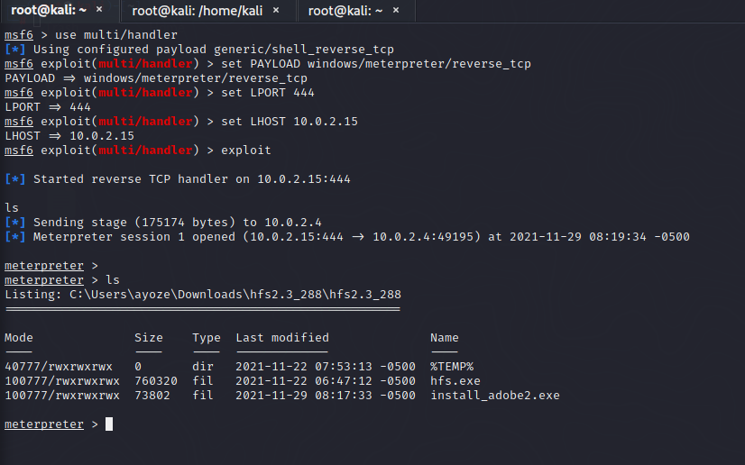

Podemos ver que hay unos cuantos comandos que podemos ejecutar, yo me informé quien era dentro de la máquina de Windows, es decir, de quién era la sesión con la que se abrió el archivo de install_adobe2.exe, miré además información del ordenador desde el que se había ejecutado y finalmente apagué la máquina de windows mediante meterpreter.

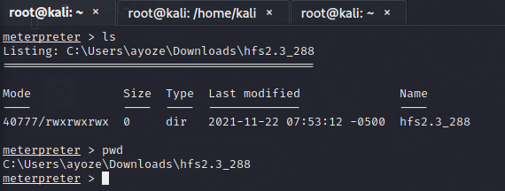

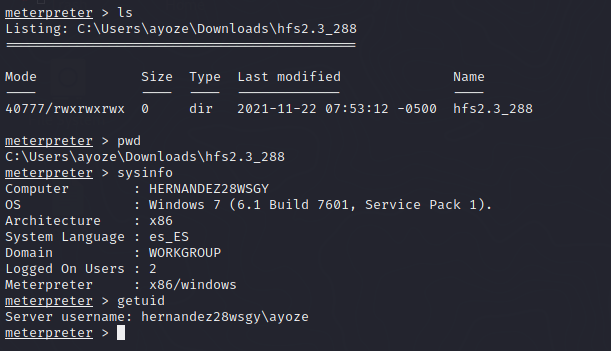

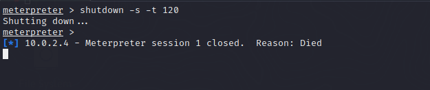
