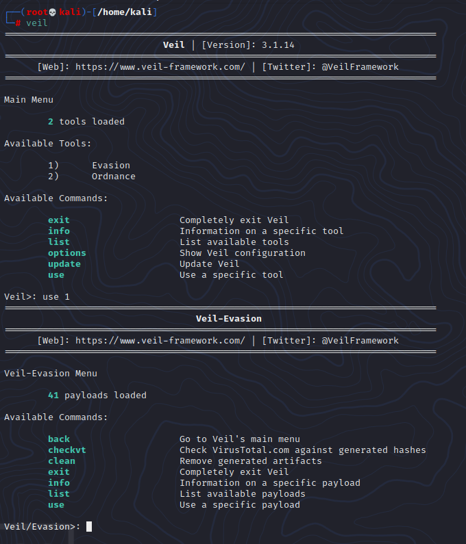
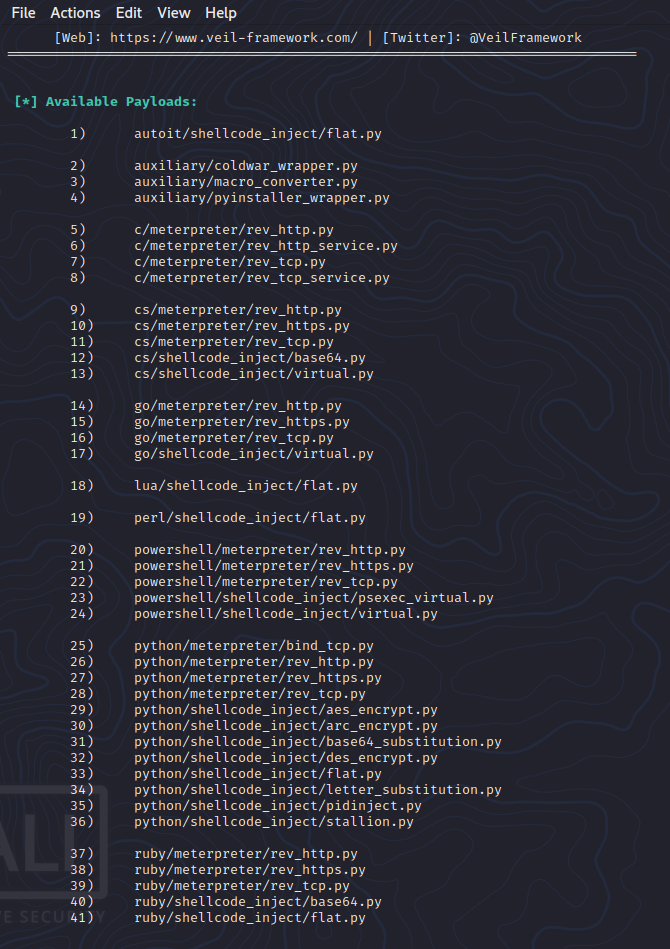
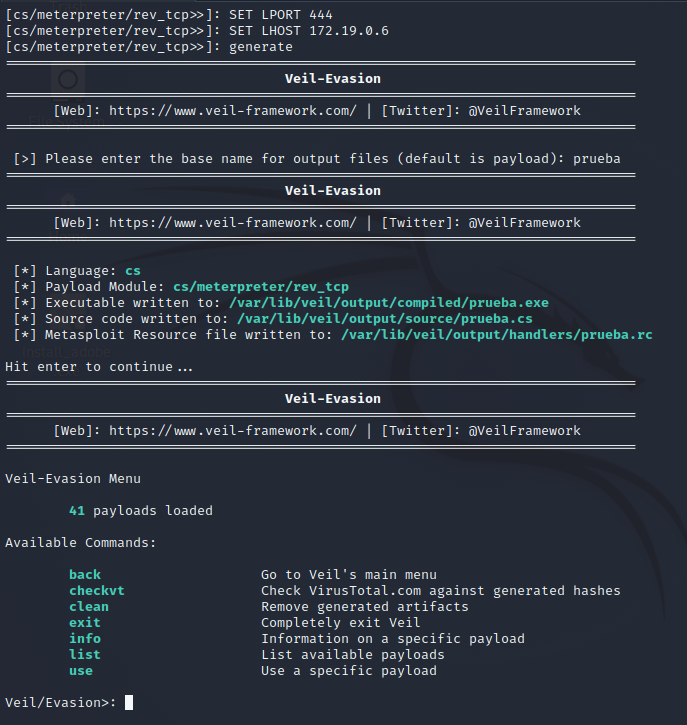
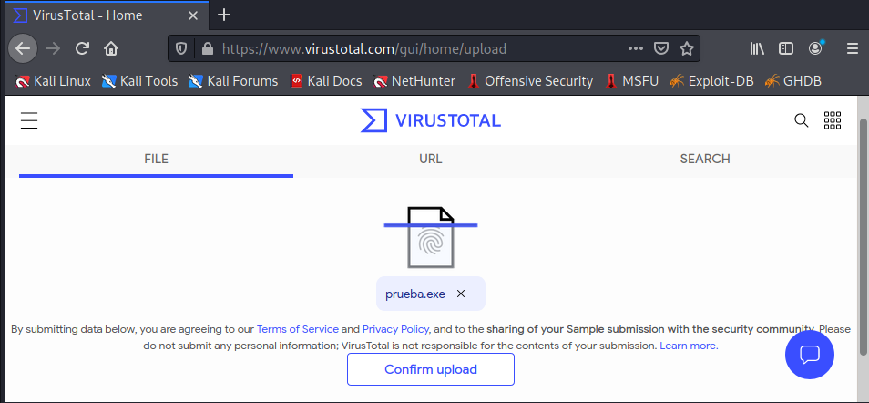
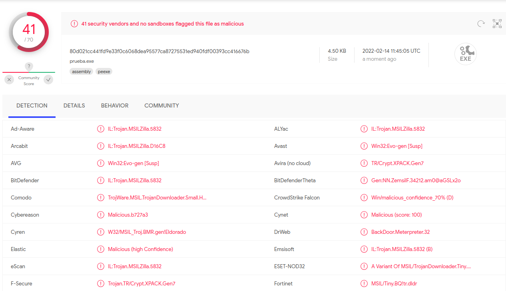
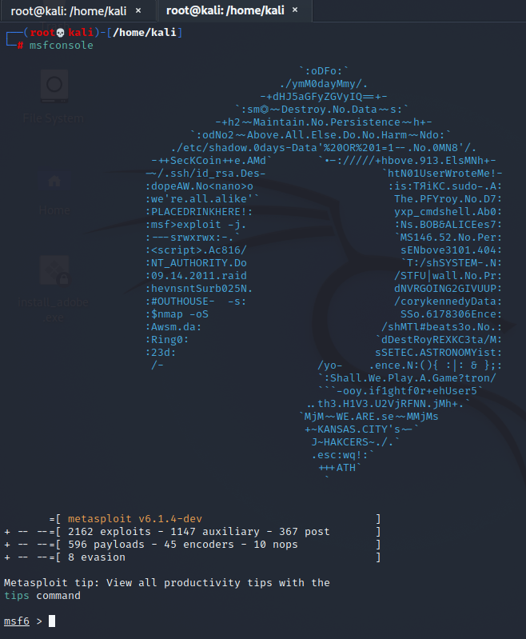

# Evasión con msfvenom y Veil.

***Nombre:*** Ayoze Hernández Díaz
***Curso:*** 2º de Ciclo Superior de Administración de Sistemas Informáticos en Red.

### ÍNDICE

+ [Introducción](#id1)
+ [Objetivos](#id2)
+ [Msfvenom](#id3)
+ [Veil](#id4)

#### ***Introducción***. 

En esta práctica se van a usar las herramientas de Kali Linux para generar archivos maliciosos para que Virus Total los analice.

#### ***Objetivos***. 

El objetivo de esta práctica es el visionado de diferentes técnicas de evasión, para ello generaremos varios archivos con varias herramientas o utilidades.

#### ***Msfvenom***. 

Con la herramienta de **msfvenom** listaremos la gran variedad de encoders o codificadores que podemos usar para generar archivos.

Primero generamos un archivo llamado meterpreter.exe que nos permitirá acceder mediante una sesión meterpreter con un payload basado en reverse_tcp siendo nuestra ip la 10.0.2.15.

Volvemos a generar un archivo meterpreter2.exe que se camufla más que el anterior debido al uso de un encoder.

Subiremos estos 2 archivos a Virus Total.

**meterpreter.exe**:

**meterpreter2.exe**:

Ahora veremos un ejemplo más práctico para esta herramienta, para ello necesitaremos la aplicación de **putty** como paquete víctima.

Volvemos a usar la herramienta de msfvenom, con la diferencia de que esta vez no vamos a crear un paquete, sino que vamos a infectar uno ya existente.

Como con las 2 prácticas anteriores, usamos el método de entrar por la herramienta de hfs (HTTP File Server).

Ahora debemos de ejecutar el programa y abrir una sesión meterpreter.

Ahora debemos de ejecutar el programa y abrir una sesión meterpreter y vemos que con exito se abrió.

#### ***Veil***. 

Ahora el otro método que usaremos para intentar evadir el escaner de Virus Total es el uso de la herramienta **veil**, si intentamos ejecutar veil vemos que no lo tenemos instalado, por lo que accedemos a ello.

Una vez realizado el proceso de instalación debemos de instalar componentes adicionales mediante la interfaz del propio veil.

Cuando esta instalación termina somos capaces de usar el veil.

Usamos la herramienta de evasión.

Seleccionamos el payload **cs/meterpreter/rev_tcp.py**.

Ahora especificamos que el puerto que escuchará es el **444** y que la ip que tiene la máquina atacante es la **172.19.0.6** y generamos el fichero **prueba.exe**.

Subimos el fichero a Virus Total y comprobamos que es funcional.

Abrimos una sesión meterpreter y entramos a la máquina.

