

# VPN en Ubuntu mediante ppp y pptpd.

***Nombre:*** Ayoze Hernández Díaz
***Curso:*** 2º de Ciclo Superior de Administración de Sistemas Informáticos en Red.

### ÍNDICE

+ [Introducción](#id1)
+ [Objetivos](#id2)
+ [Instalación y configuración](#id3)
+ [Acceso a la VPN](#id4)

#### ***Introducción***. 

En esta práctica se van a usar las herramientas que Ubuntu Desktop nos proporciona para generar una VPN y conectarnos desde Windows a la VPN de Ubuntu.

#### ***Objetivos***. 

Conexión mediante un tunel VPN desde Windows a Ubuntu.

#### ***Instalación y configuración***. 

Empezamos instalando los paquetes **ppp** y **pptpd** para poder generar la VPN.

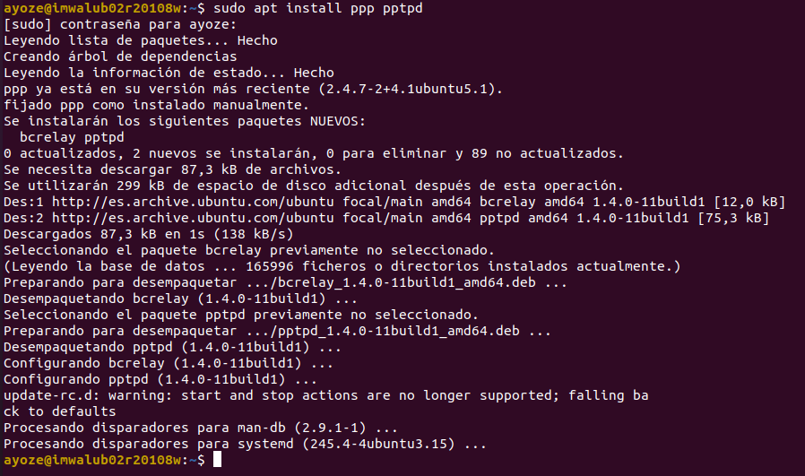

> **NOTA IMPORTANTE:** La máquina de Ubuntu debe tener 2 interfaces de red, una se usará como tunel y la otra para salir a internet.

Configuración de la interfaz 1 (Adaptador puente):

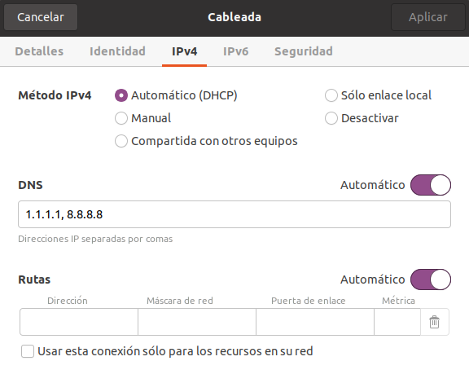

Configuración de la interfaz 2 (Red interna):

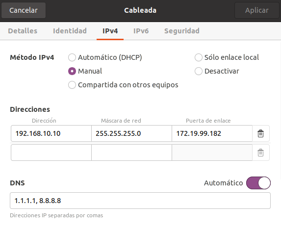

Configuración de la interfaz de Windows:

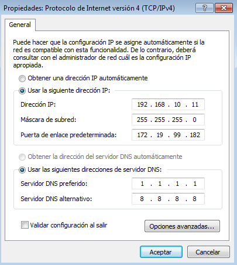

Editamos el fichero **/etc/pptpd.conf** y añadimos las lineas:

* **localip 172.19.99.182**. Especifica la ip de la máquina servidor
* **remoteip 192.168.10.10-11**. Especifica las ips que puede tomar la máquina cliente.

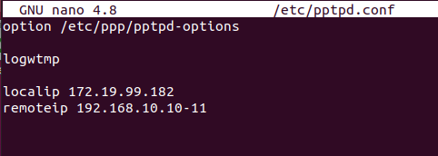

Editamos el fichero **/etc/ppp/chap-secrets** y añadimos la línea:

* alub02r20108w       pptpd           "1234"          *

> **NOTA:** Se cambió el usuario al que se conecta debido a que es el usuario remoto para la máquina cliente y no para el servidor

Lo que hace esta linea es especficar que usuario se puede conectar, con qué contraseña y con que ip.

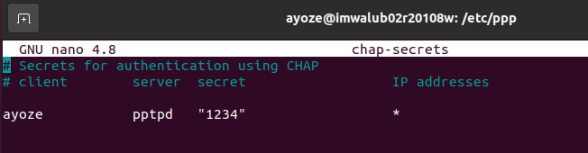

Editamos el fichero **/etc/ppp/options** y añadimos los servidores DNS que nosotros prefiramos, 8.8.8.8 y 1.1.1.1 en mi caso.

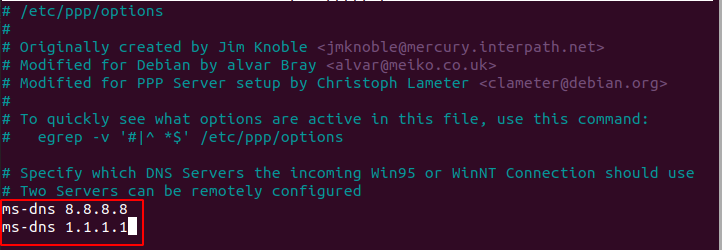

Ahora reiniciamos el servicio de pptpd para que surjan efecto los cambios y comprobamos que todo fue bien.

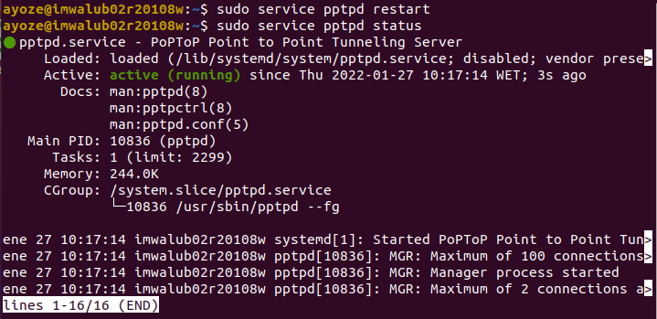

Ejecutamos el comando sudo sysctl net.ipv4.ip_forward para comprobar el estado del ip forwarding, que como es 0 está deshabilitado.

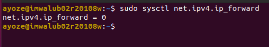

Lo habilitamos con sudo sysctl -w net.ipv4.ip_forward=1 para habilitarlo.

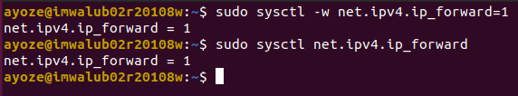

Habilitamos el postrouting y enmascaramos nuestra dirección IP con sudo iptables -t nat -A POSTROUTING -o enp0s3 -j MASQUERADE.

#### ***Acceso a la VPN***. 

Nos dirigimos al **panel de control > Redes e Internet > Centro de redes y recursos compartidos** y añadimos una nueva conexión.

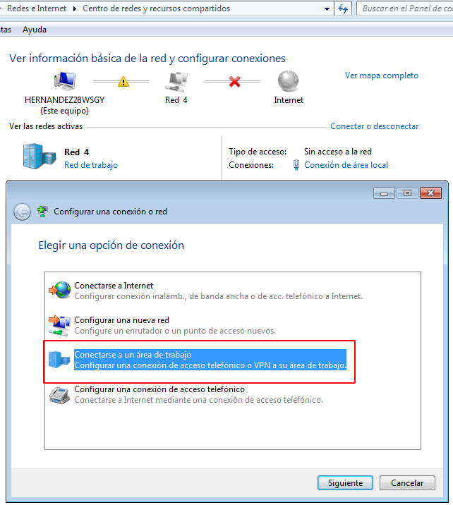

Nos conectamos a nuestra VPN.

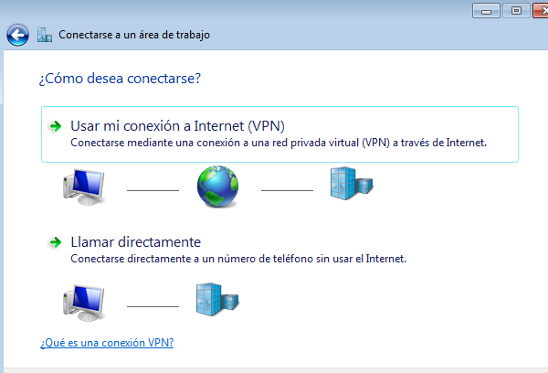

Configuramos una conexión a Internet.

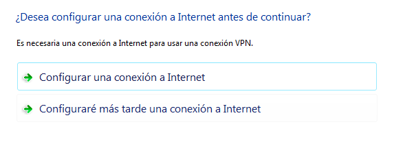

Especificamos el usuarios que se usará para la conexión y cambiamos los siguientes aspectos de las conexiones.

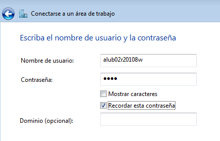

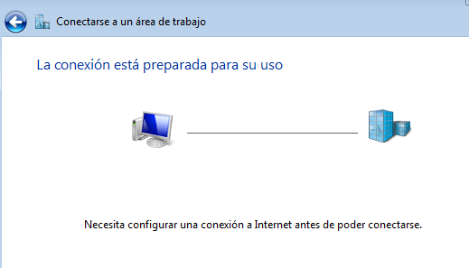

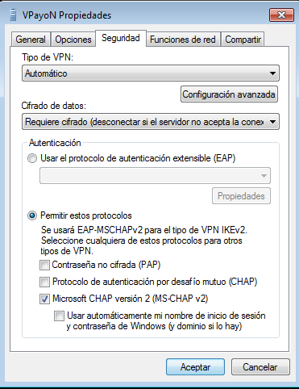

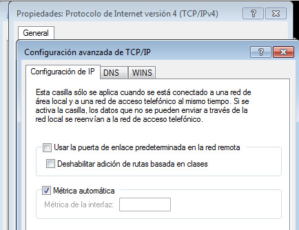

Nos conectamos a la VPayoN.

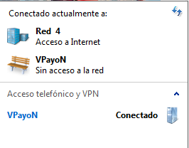

Realizamos un tracert para ver que saltos damos.

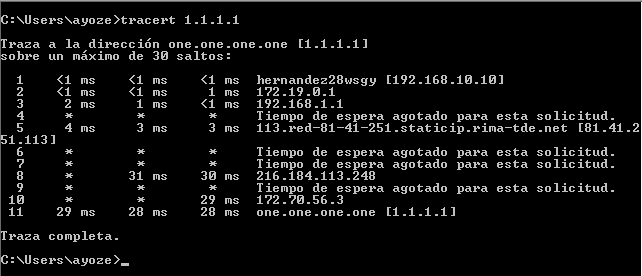
