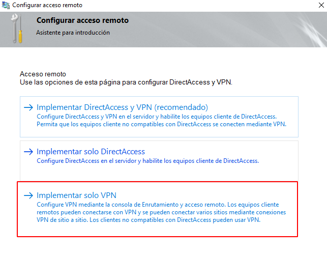
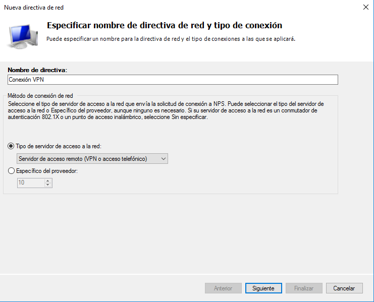
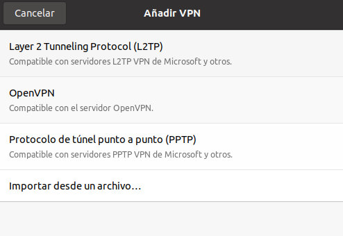
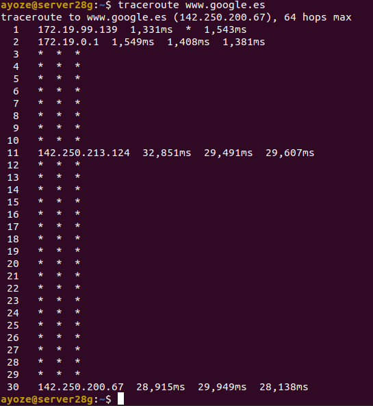

# TÍTULO DE LA PRÁCTICA

***Nombre:*** Ayoze Hernández Díaz
***Curso:*** 2º de Ciclo Superior de Administración de Sistemas Informáticos en Red.

### ÍNDICE

+ [Introducción](#id1)
+ [Objetivos](#id2)
+ 
+ 
+ 

#### ***Introducción***. 

#### ***Objetivos***. 

#### ***Instalación***. 

Para empezar debemos tener una máquina de windows server 2016 arrancada y crear un usuario que se usará unicamente par las conexiones VPN.

En la sección de marcado permitimos acceso a las redes y el otorgamos permiso de devolución de llamada.

Instalamos el rol de **Acceso remoto** y sus características.

Accedemos a la herramienta de acceso remoto y la configuramos a nuestro gusto.

Aquí vamos a la sección de Configurar y habilitar Enrutamiento y acceso remoto.

Aquí elegimos la opción de configuración personalizada.

Queremos el acceso a VPN y el NAT.

Finalizamos.

Iniciamos el servicio.

#### ***Configuración del firewall de windows***. 

Debemos de añadir las siguientes reglas relacionadas con los puertos asociados a los protocolos GRE, L2TP, TCP y UDP tanto en las reglas de salida como en las de entrada.

Iniciamos el NPS (Network Policy Server).

Vamos al apartado de **configurar cuentas**.

Se nos abre un cuadro adicional vamos con opciones por defecto.

Habilitamos esas directivas.

Añadimos más directivas de red especificando que son para servidores de acceso **remoto/vpn**.

Hacemos que la condición se pertenecer al grupo vpnusers.

Concedemos permiso para acceder.

En las siguientes imágenes se muestran campos adicionales que se pueden configurar.

Agregamos un atributo que permita el protocoo PPTP (Point-to-Point Tunneling Protocol)

Vemos un resumen de la directiva.

Vamos a la configuración del windows cliente al apartado de VPN y agregamos una nueva.

Se nos abre un cuadro que hay que rellenar de la siguiente manera:

Configuramos una nueva red.

Especificamos que queremos la Ip del servidor y le damos un nombre a la conexión.

El usuario vpn es el que tiene acceso por lo que lo ponemos aquí.

Nos conectamos a la vpn y hacemos un tracert a 1.1.1.1 y vemos que sale por la maquina servidor y luego a la red.

Ahora en **ubuntu** añadimos una vpn con el protocolo Layer 2 Tunneling Protocol (L2TP).

Añadimos los datos de la red a la que nos queremos conectar.

En opciones avanzadas usamos el cifrado punto a punto (MPPE).

Hacemos un traceroute a www.google.es

#### ***Conclusiones***. 
