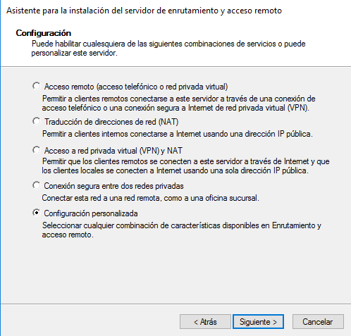

# TÍTULO DE LA PRÁCTICA

***Nombre:*** Ayoze Hernández Díaz
***Curso:*** 2º de Ciclo Superior de Administración de Sistemas Informáticos en Red.

### ÍNDICE

+ 
+ 
+ 
+ 
+ 

#### ***Introducción***. 

#### ***Objetivos***. 

#### ***Material empleado***. 

#### ***Desarrollo***. 

#### ***Conclusiones***. 

