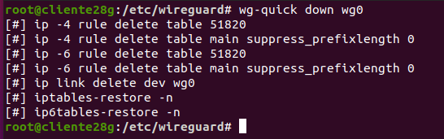
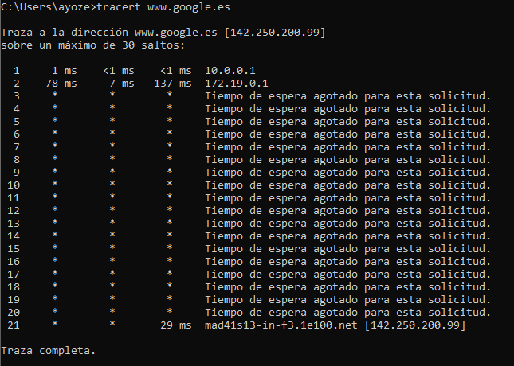

<center>

# VPN TUNNELING con Wireguard


</center>

***Nombre:*** Ayoze Hernández Díaz
***Curso:*** 2º de Ciclo Superior de Administración de Sistemas Informáticos en Red.

### ÍNDICE

+ [Introducción](#id1)
+ [Objetivos](#id2)
+ [Instalación](#id3)
+ [Ficheros de configuración](#id4)
+ [Captura de la ruta](#id5)

#### ***Introducción***. <a name="id1"></a>

Wireguard es una aplicación tanto de escritorio como de dispositivos móviles que permite la conexión entre servidor, cliente e internet.

#### ***Objetivos***. <a name="id2"></a>

El objetivo es crear un túnel con una máquina cliente WINDOWS y una máquina servidor Ubuntu y hacer una captura de la ruta que toman los paquetes para salir a internet.

#### ***Instalación***. <a name="id3"></a>

La instalación de Wireguard es tan sencilla como ejecutar apt -y install wireguard en la terminal de ubuntu.


#### ***Ficheros de configuración***. <a name="id4"></a>

El profesor nos proporcionó varias páginas guiadas que podiamos seguir para realizar la practica, pero al final no usamos casi ningún comando de los allí descritos porque era lo mismo que generar nosotros los ficheros.

Fichero de configuración del servidor:

```
[Interface]
Address = 10.0.0.1/24
ListenPort = 51820
PrivateKey = oOcNBCOgztu3YQOt0BEugueDL499VZ5UxrrePKkl/ng=
PostUp = iptables -A FORWARD -i %i -j ACCEPT; iptables -t nat -A POSTROUTING -o enp0s3 -j MASQUERADE
PostDown = iptables -D FORWARD -i %i -j ACCEPT; iptables -t nat -D POSTROUTING -o enp0s3 -j MASQUERADE

[Peer]
PublicKey = Dc050W3ZuCB8T6KFSyuW4atHaf7ssw5/xtpn2Si/+3E=
AllowedIPs = 10.0.0.2/32

[Peer]
PublicKey = KEmZ+Bsf9lgdL9k74nmAoisQVtzRCUCYYhIAYjlxQFM=
AllowedIPs = 10.0.0.3/32

```

Fichero de configuración del cliente de Windows:

```
[Interface]
PrivateKey = ADdP9zssI9I1UCF5foz6R2FSRye40Jx3NKOggsfCtWQ=
ListenPort = 51820
Address = 10.0.0.3/24
DNS = 1.1.1.1

[Peer]
PublicKey = o6JHaYd6rJijSBVy0bD/TosQasK5Bo7yB+FDwFNyl1Y=
AllowedIPs = 0.0.0.0/0, ::/0
Endpoint = 172.19.99.214:51820
```

Fichero de configuración del cliente Ubuntu:

```
[Interface]
Address = 10.0.0.2/24
ListenPort = 51820
PrivateKey = UEG2SFTl2fWy+jGLBoOohNFxIG82iYQImUrZmI7De28=

[Peer]
PublicKey = o6JHaYd6rJijSBVy0bD/TosQasK5Bo7yB+FDwFNyl1Y=
AllowedIPs = 0.0.0.0/0, ::/0
Endpoint = 172.19.99.214:51820
```

#### ***Captura de la ruta***. <a name="id5"></a>

Para activar los ficheros debemos de habilitarlos con el siguiente comando tanto en el cliente como en el servidor:

* ```wg-quick up wg0```


Para deshabilitarlos debemos de ejecutar el siguiente:

* ```wg-quick down wg0```



Habilitamos también el fichero de windows mediante la interfaz gráfica.

Hacemos una traza en windows a google con **tracert www.google.es**


