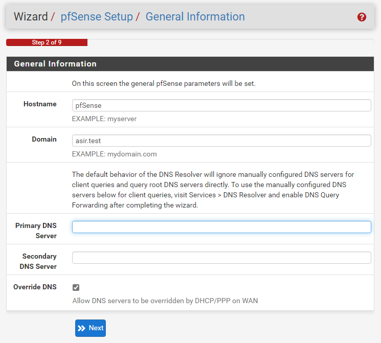
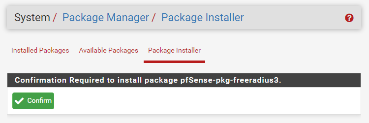
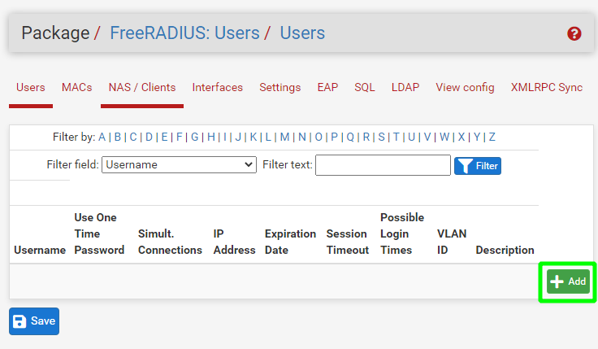

# Instalación y configuración de un servidor Pfsense

***Nombre:*** Ayoze Hernández Díaz
***Curso:*** 2º de Ciclo Superior de Administración de Sistemas Informáticos en Red.

### ÍNDICE

+ [Introducción](#id1)
+ [Objetivos](#id2)
+ [Material empleado](#id3)
+ 
+ 

#### ***Introducción***. 

En esta práctica lo que se pretende es realizar la instalación y configuración de un servidor Pfsense para que tengamos que registrarnos en la red para acceder a ella.

#### ***Objetivos***. 

Con esta práctica se pretende controlar el acceso de los clientes a la red.

#### ***Material empleado***. 

Usaremos 3 máquinas:

* Servidor Pfsense
* Cliente Windows 10
* Cliente Ubuntu 20.4

#### ***Instalación del servidor Pfsense***. 

Empezamos la instalación del servidor Pfsense y para ello debemos de aceptar los terminos de distribución.

Queremos instalar Pfsense.

Escogemos el teclado español con los acentos.

Queremos que las particiones sean por defecto.

Cuando terminamos nos aparece la siguiente pantalla con menú.

#### ***Configuración***. 

En el cliente Windows usaremos la siguiente configuración de red en la que tenemos tanto en gateway como en DNS la ip LAN del servidor Pfsense.

Accedemos a la dirección web 192.168.1.1 con las siguientes credenciales:

* User = admin
* Passwd = pfsense

Empezamos a configurar el FQDN (Fully Qualified Domain Name) del server que será pfsense.asir.test

> **NOTA:** La parte de pfsense en pfsense.asir.test se añade automáticamente.

Establecemos la zona horaria

