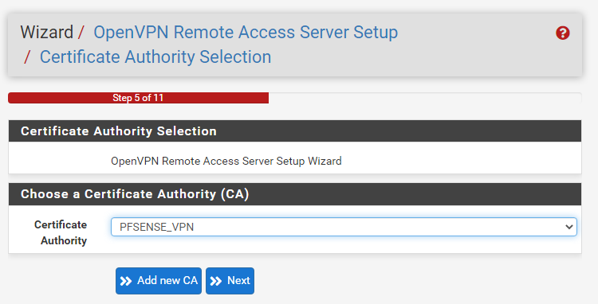
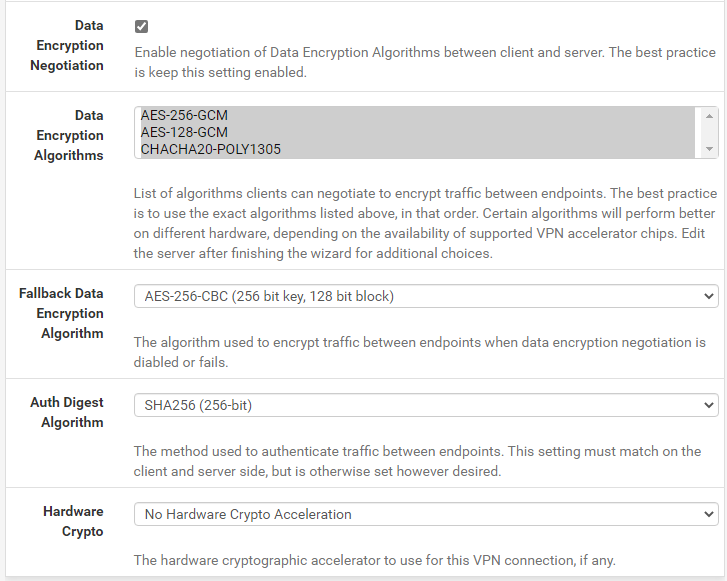

# OpenVPN en Pfsense.

***Nombre:*** Ayoze Hernández Díaz
***Curso:*** 2º de Ciclo Superior de Administración de Sistemas Informáticos en Red.

### ÍNDICE

+ [Introducción](#id1)
+ [Objetivos](#id2)
+ [Instalación del paquete OpenVPN](#id3)
+ [Creación de usuarios](#id4)
+ [Conexión VPN](#id5)

#### ***Introducción***. 

Pfsense es una distribución de linux diseñada para actuar como Firwall o enrutador.

#### ***Objetivos***. 

El objetivo es instalar el paquete de OpenVPN en nuestro servidor Pfsense para crear una conexión segura entre nuestros usuarios e internet mediante un túnel.

#### ***Instalación del paquete OpenVPN***. 

Para poder instalar el servicio/paquete debemos generar un certificado dedicado para el servicio de OpenVPN.

Rellenamos los datos del certificado.

Indicamos el tipo de acceso que queramos dar a los usuarios para la VPN.

Indicamos la entidad emisora para el certificado.

Se completan los siguientes por defecto y nos aparece lo siguiente, especificamos que la Interfaz sea de tipo WAN.

Añadimos una ip para el túnel y marcamos el recuadro para redireccionar la puerta de enlace y en local network lo podemos dejar en blanco para que tome valores por defecto.

Aceptamos y avanzamos.

Accedemos al apartado **System>Package Manage>Package Installer**.

#### ***Creación de usuarios***. 

Creamos el usuario VPN para las conexiones VPN y configuramos alguna que otra opción.

#### ***Conexión VPN***. 

Editamos las opciones de conexión de los clientes haciendo que accedan mediante la interfaz WAN y especificamos el host de la máquina servidor

Especificamos que usuario es el que se va a conectar mediante el uso de la pasarela/túnel.

Configuramos algunos áspectos más como el certificado usado para el servicio.

Aquí cambiamos la opción de gateway a IPv4 only.

En el apartado de **Services>OpenVPN>Open-VPN-Clientexport** descargamos el ejecutable para windows de 64 bits y lo ejecutamos en la máquina cliente y lo ejecutamos de todas formas.

Instalamos

Instalamos los paquetes adicionales.

Nos sale el siguiente cuadro de inicio de sesión.

